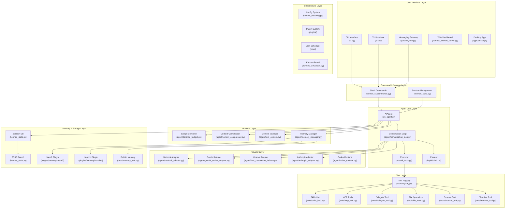
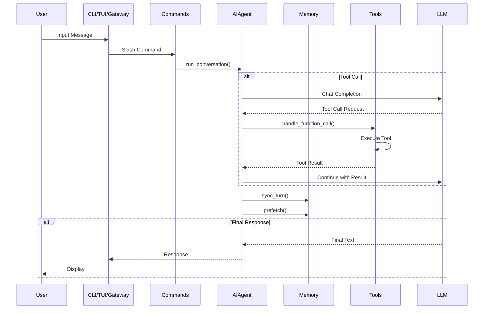
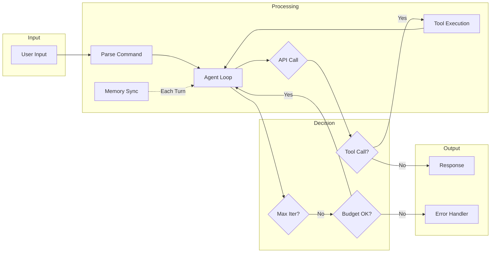

# 第二部分：整体架构分析

## 2.1 完整架构图（Mermaid）



## 2.2 层间调用关系

### 调用层次图



## 2.3 数据流向

```
┌─────────────────────────────────────────────────────────────────────────┐
│                         数据流向图                                       │
├─────────────────────────────────────────────────────────────────────────┤
│                                                                         │
│  ┌──────────┐    ┌──────────┐    ┌──────────┐    ┌──────────┐        │
│  │   User   │───▶│   CLI/   │───▶│ AIAgent  │───▶│   LLM    │        │
│  │  Input   │    │  TUI/    │    │  Core    │    │ Provider │        │
│  └──────────┘    │ Gateway  │    └────┬─────┘    └────┬─────┘        │
│                  └──────────┘         │               │              │
│                                       │               │              │
│                              ┌────────┴────────┐      │              │
│                              │                 │      │              │
│                              ▼                 ▼      ▼              │
│                        ┌──────────┐      ┌──────────────┐            │
│                        │  Memory  │◀────▶│    Tools     │            │
│                        │ Manager  │      │   Registry   │            │
│                        └────┬─────┘      └──────┬───────┘            │
│                             │                   │                    │
│                             ▼                   ▼                    │
│                       ┌──────────┐        ┌──────────┐              │
│                       │ Session  │        │  MCP/    │              │
│                       │    DB    │        │  Skills  │              │
│                       └──────────┘        └──────────┘              │
│                                                                         │
└─────────────────────────────────────────────────────────────────────────┘
```

## 2.4 控制流向



## 2.5 每层职责详解

| 层级 | 职责 | 核心文件 |
|-----|------|---------|
| **UI Layer** | 用户交互接口，负责输入接收和输出展示 | cli.py, ui-tui/, gateway/ |
| **Command Layer** | 命令解析和调度，处理 Slash Commands | hermes_cli/commands.py |
| **Agent Core** | Agent 主循环，LLM 调用编排 | run_agent.py, conversation_loop.py |
| **Runtime Layer** | 上下文管理、Token 控制、压缩 | turn_context.py, context_compressor.py |
| **Tool Layer** | 工具执行、工具注册、工具发现 | tools/*.py, registry.py |
| **Provider Layer** | 多 LLM 提供者适配 | agent/*_adapter.py |
| **Memory Layer** | 记忆存储、检索、同步 | agent/memory_manager.py |
| **Infrastructure** | 配置、插件、调度、持久化 | hermes_cli/, cron/, plugins/ |
