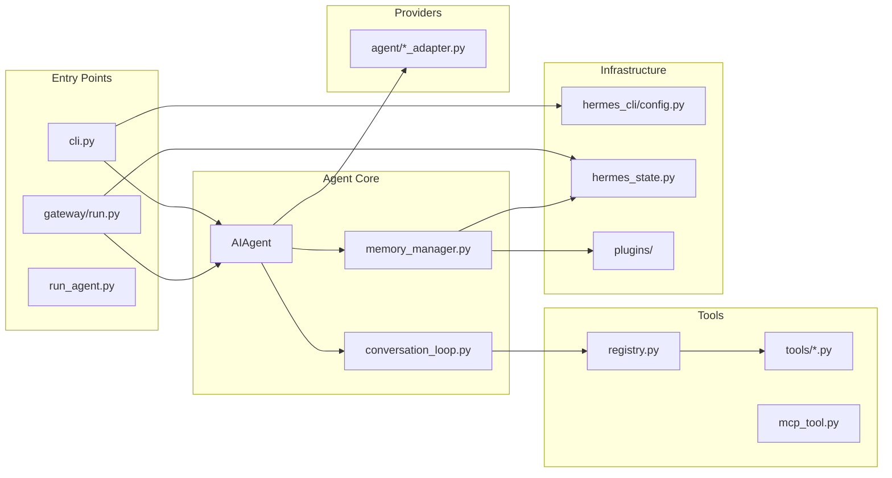

# 第三部分：代码目录逆向分析

## 3.1 目录树结构

```
hermes-agent/
├── run_agent.py           # AIAgent 核心类 (5,568 LOC)
├── model_tools.py         # 工具编排层 (1,256 LOC)
├── toolsets.py            # 工具集定义
├── cli.py                 # 交互式 CLI (15,197 LOC)
├── batch_runner.py        # 并行批处理
├── hermes_state.py        # SQLite 会话存储 (FTS5)
├── hermes_constants.py    # 路径常量
├── hermes_logging.py      # 日志系统
│
├── agent/                 # Agent 内部模块 (顶层 93 个 .py 文件)
│   ├── conversation_loop.py    # 对话循环核心
│   ├── memory_manager.py       # 记忆管理器
│   ├── memory_provider.py      # 记忆提供者 ABC
│   ├── context_compressor.py   # 上下文压缩
│   ├── prompt_builder.py        # 提示构建
│   ├── tool_executor.py         # 工具执行器
│   ├── curator.py               # 技能策展人
│   ├── *                        # 各 Provider 适配器
│
├── tools/                 # 工具实现 (顶层 87 个 .py 文件)
│   ├── registry.py             # 工具注册中心
│   ├── terminal_tool.py         # 终端控制
│   ├── browser_tool.py          # 浏览器控制
│   ├── file_tools.py            # 文件操作
│   ├── delegate_tool.py         # 子 Agent 委托
│   ├── mcp_tool.py              # MCP 协议
│   ├── skills_tool.py           # 技能管理
│   ├── memory_tool.py            # 内置记忆
│   ├── environments/            # 终端后端
│   │   ├── local.py
│   │   ├── docker.py
│   │   ├── ssh.py
│   │   ├── singularity.py
│   │   ├── modal.py
│   │   └── daytona.py
│
├── hermes_cli/            # CLI 子系统 (递归 184 个 .py 文件)
│   ├── main.py                 # 主入口
│   ├── config.py               # 配置管理
│   ├── commands.py             # 命令注册表
│   ├── banner.py               # 横幅显示
│   ├── cli_output.py           # 输出格式化 (另见 agent/display.py)
│   ├── setup.py                # 设置向导
│   ├── gateway.py              # 网关管理
│   ├── kanban.py               # 看板 CLI
│   ├── profiles.py             # 多配置文件
│   ├── plugins.py              # 插件管理
│   ├── skin_engine.py          # 主题引擎
│   ├── slack_cli.py            # Slack 接入 (另见 subcommands/slack.py)
│   └── subcommands/            # 子命令
│
├── gateway/                # 消息网关 (递归 62 个 .py 文件)
│   ├── run.py                 # 网关主循环 (17,851 LOC)
│   ├── session.py             # 会话管理
│   ├── config.py               # 网关配置
│   ├── platform_registry.py    # 平台自注册中心 (PlatformEntry/PlatformRegistry)
│   ├── slash_commands.py       # 网关斜杠命令
│   └── platforms/              # 平台适配器 (18 个 .py 文件)
│       ├── signal.py
│       ├── weixin.py
│       ├── whatsapp_cloud.py
│       ├── yuanbao.py
│       ├── bluebubbles.py
│       ├── qqbot/
│       ├── msgraph_webhook.py
│       ├── webhook.py
│       ├── api_server.py
│       └── ...
│       # 注：Telegram 在 plugins/platforms/telegram/；
│       #     Slack 在 hermes_cli/slack_cli.py + subcommands/slack.py；
│       #     Discord 在 tools/discord_tool.py
│
├── ui-tui/                # Ink React TUI
│   ├── src/
│   │   ├── app.tsx
│   │   ├── components/
│   │   └── store/
│   └── package.json
│
├── tui_gateway/           # TUI Python 后端
├── cron/                  # 定时任务调度
│   ├── jobs.py
│   └── scheduler.py
├── plugins/               # 插件系统
│   ├── memory/                 # 记忆提供者插件
│   │   ├── honcho/
│   │   ├── mem0/
│   │   └── ...
│   ├── model-providers/         # 模型提供者插件
│   ├── kanban/
│   └── ...
├── skills/                 # 内置技能
├── optional-skills/       # 可选技能
├── tests/                 # 测试套件 (~900 文件)
├── website/               # Docusaurus 文档站
└── docs/                  # 文档
```

## 3.2 核心目录详解

### 3.2.1 `agent/` - Agent 内部模块

**作用**：封装 AIAgent 的核心功能模块，提供 Provider 适配、记忆管理、上下文压缩等核心能力。

**核心模块**：

> 说明：`agent/` 下的多数文件是**模块级函数集合**，而非类。仅 `AIAgent`、`MemoryManager`、`MemoryProvider`（ABC）、`ContextCompressor` 等少数是真实的类。

| 类/模块 | 类型 | 职责 | 关键符号 |
|--------|------|------|---------|
| `AIAgent` (run_agent.py:333) | 类 | Agent 主类 | `chat()` (5325), `run_conversation()` (5302), `interrupt()` (2376) |
| `conversation_loop.py` | 模块函数 | 对话循环逻辑 | `run_conversation()` (495) |
| `MemoryManager` (memory_manager.py:314) | 类 | 记忆管理器 | `add_provider()`, `prefetch_all()`, `sync_all()`, `build_system_prompt()` |
| `context_compressor.py` | 模块/类 | 上下文压缩 | 压缩相关函数 |
| `prompt_builder.py` | 模块函数 | 提示构建 | `build_skills_system_prompt()` 等模块级函数 |
| `tool_executor.py` | 模块函数 | 工具执行 | `execute_tool_calls_concurrent()` (260), `execute_tool_calls_sequential()` (792) |
| `anthropic_adapter.py` | 模块函数 | Anthropic 提供者适配 | 模块级适配函数 |

**核心接口**：

```python
# MemoryProvider ABC
class MemoryProvider(ABC):
    def initialize(self, session_id, **kwargs)
    def system_prompt_block(self) -> str
    def prefetch(self, query, session_id) -> str
    def sync_turn(self, user, assistant, messages, session_id)
    def get_tool_schemas(self) -> List[Dict]
    def handle_tool_call(self, tool_name, args) -> str
    def shutdown(self)
```

**核心数据结构**：

> 说明：系统**不使用** `Message`/`SessionState` 等 dataclass。消息是普通 **dict**（`{"role": ..., "content": ...}`），工具调用/结果只是 dict 字段。会话状态由 `SessionDB`（hermes_state.py:667，SQLite 持久化）承载。

```python
# 消息：普通 dict，而非 dataclass
message = {
    "role": "user",        # system/user/assistant/tool
    "content": "...",
    "tool_calls": [...],    # 可选，assistant 消息携带
    "tool_call_id": "...",  # 可选，tool 消息携带
}

# 工具条目：tools/registry.py:77 的普通类（带 __slots__，非 NamedTuple）
class ToolEntry:
    __slots__ = (
        "name", "toolset", "schema", "handler",
        "check_fn", "requires_env", ...
    )
```

**核心设计模式**：

1. **Adapter Pattern**：各 Provider 适配器统一接口
2. **Strategy Pattern**：多种记忆提供者可切换
3. **Observer Pattern**：Curator 观察技能使用情况
4. **Factory Pattern**：`AIAgent.__init__` 根据配置创建组件

### 3.2.2 `tools/` - 工具实现

**作用**：实现 Agent 可调用的各种工具，包括终端控制、文件操作、浏览器控制等。

**核心模块**：

> 说明：除 `ToolRegistry`/`ToolEntry` 外，`terminal_tool`、`browser_tool`、`file_tools`、`delegate_tool`、`mcp_tool` 等都是**工具模块**，在 import 时通过 `registry.register(...)` 自注册，**没有**同名的 `TerminalTool`/`BrowserTool` 等类。

| 类/模块 | 类型 | 职责 |
|--------|------|------|
| `ToolRegistry` (registry.py:151) | 类 | 工具注册中心 |
| `ToolEntry` (registry.py:77) | 类（带 `__slots__`） | 单个工具注册条目 |
| `discover_builtin_tools` (registry.py:57) | 模块级函数 | 发现并加载内置工具 |
| `terminal_tool.py` | 工具模块 | 终端命令执行（自注册） |
| `browser_tool.py` | 工具模块 | 浏览器自动化（自注册） |
| `file_tools.py` | 工具模块 | 文件读写操作（自注册） |
| `delegate_tool.py` | 工具模块 | 子 Agent 委托（自注册） |
| `mcp_tool.py` | 工具模块 | MCP 协议工具（自注册） |

**核心接口**：

```python
# 工具注册
registry.register(
    name="tool_name",
    toolset="toolset_name",
    schema={"name": "...", "parameters": {...}},
    handler=lambda args, **kw: tool_func(**kw),
    check_fn=check_requirements,
    requires_env=["API_KEY"],
)

# 工具条目：普通类（带 __slots__），而非 NamedTuple；定义于 tools/registry.py:77
class ToolEntry:
    __slots__ = (
        "name", "toolset", "schema", "handler",
        "check_fn", "requires_env", "is_async",
        "description", "emoji", ...
    )

# 内置工具发现：模块级函数（tools/registry.py:57），
# 注意它不是 ToolRegistry 的方法；ToolRegistry 也没有 get_all_tools 方法。
discover_builtin_tools(tools_dir=None)  # -> List[str]
```

**核心设计模式**：

1. **Registry Pattern**：自注册工具，运行时发现
2. **Strategy Pattern**：不同终端后端可切换
3. **Command Pattern**：工具调用封装
4. **Chain of Responsibility**：工具链执行

### 3.2.3 `hermes_cli/` - CLI 子系统

**作用**：命令行界面实现，包括交互式 REPL、命令处理、配置管理等。

**核心类**：

| 类/模块 | 职责 |
|--------|------|
| `HermesCLI` | CLI 主类 |
| `CLIAgentSetupMixin` | Agent 配置混入 |
| `CLICommandsMixin` | 命令处理混入 |
| `ConfigManager` | 配置管理 |
| `SkinEngine` | 主题引擎 |

**核心接口**：

```python
# 命令定义
CommandDef = NamedTuple('CommandDef', [
    ('name', str),
    ('description', str),
    ('category', str),
    ('aliases', Tuple[str, ...]),
    ('args_hint', str),
    ('cli_only', bool),
])

# 命令处理
COMMAND_REGISTRY: List[CommandDef]
```

### 3.2.4 `gateway/` - 消息网关

**作用**：多消息平台统一接入。平台通过 `gateway/platform_registry.py`（`PlatformEntry`/`PlatformRegistry`）自注册。

> 说明：`gateway/platforms/` 下**不含** `telegram.py`/`discord.py`/`slack.py`。真实平台文件为 `signal.py`、`weixin.py`、`whatsapp_cloud.py`、`yuanbao.py`、`bluebubbles.py`、`qqbot/`、`msgraph_webhook.py`、`webhook.py`、`api_server.py` 等（共 18 个 .py）。Telegram 位于 `plugins/platforms/telegram/`；Slack 位于 `hermes_cli/slack_cli.py` + `hermes_cli/subcommands/slack.py`；Discord 位于 `tools/discord_tool.py`。

**核心类**：

| 类/模块 | 职责 |
|--------|------|
| `GatewayRunner` (gateway/run.py:2475) | 网关主循环入口类 |
| `PlatformRegistry` / `PlatformEntry` (platform_registry.py) | 平台自注册中心与条目 |
| 各平台模块 | signal/weixin/whatsapp_cloud/yuanbao 等 |

**核心接口（概念性）**：

> 说明：以下为平台接入的概念性接口示意；实际平台通过 `PlatformRegistry` 注册 `PlatformEntry`，消息以 dict 形式流转（无 `Message` 类）。

```python
# 概念性平台接入接口（非字面类签名）
#   connect() / disconnect()
#   send_message(text, session_key)
#   receive_message() -> dict   # 消息为 dict，而非 Message 类
#   get_commands() -> List[CommandDef]
```

### 3.2.5 `tools/environments/` - 终端后端

**作用**：提供不同运行环境的终端抽象。

**后端列表**：

| 后端 | 文件 | 特点 |
|-----|------|-----|
| Local | `local.py` | 本地直接执行 |
| Docker | `docker.py` | 容器隔离 |
| SSH | `ssh.py` | 远程执行 |
| Singularity | `singularity.py` | HPC 环境 |
| Modal | `modal.py` | Serverless |
| Daytona | `daytona.py` | 云端持久化 |

## 3.3 模块依赖图


