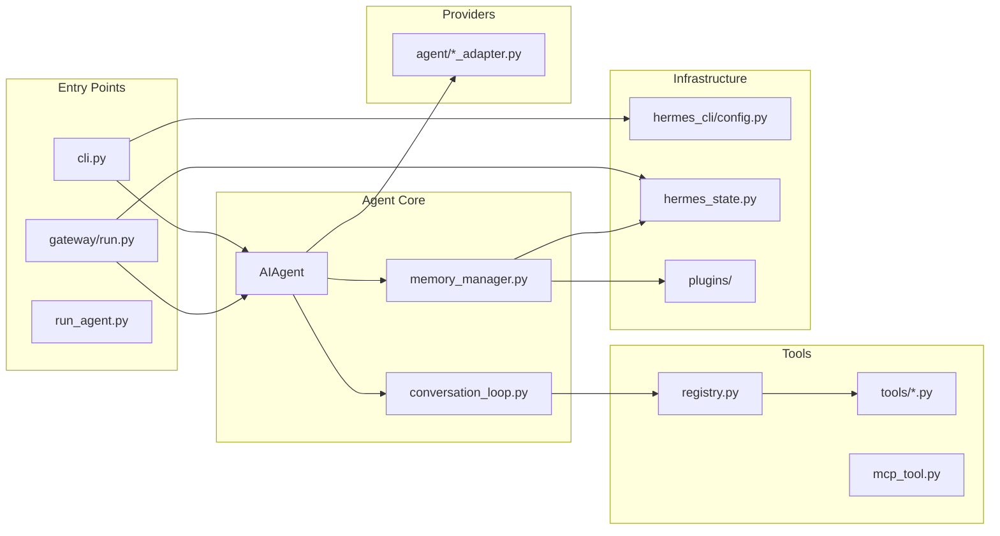

# 第三部分：代码目录逆向分析

## 3.1 目录树结构

```
hermes-agent/
├── run_agent.py           # AIAgent 核心类 (~12k LOC)
├── model_tools.py         # 工具编排层 (~2k LOC)
├── toolsets.py            # 工具集定义
├── cli.py                 # 交互式 CLI (~11k LOC)
├── batch_runner.py        # 并行批处理
├── hermes_state.py        # SQLite 会话存储 (FTS5)
├── hermes_constants.py    # 路径常量
├── hermes_logging.py      # 日志系统
│
├── agent/                 # Agent 内部模块 (~60 文件)
│   ├── conversation_loop.py    # 对话循环核心
│   ├── memory_manager.py       # 记忆管理器
│   ├── memory_provider.py      # 记忆提供者 ABC
│   ├── context_compressor.py   # 上下文压缩
│   ├── prompt_builder.py        # 提示构建
│   ├── tool_executor.py         # 工具执行器
│   ├── curator.py               # 技能策展人
│   ├── *                        # 各 Provider 适配器
│
├── tools/                 # 工具实现 (~70 文件)
│   ├── registry.py             # 工具注册中心
│   ├── terminal_tool.py         # 终端控制
│   ├── browser_tool.py          # 浏览器控制
│   ├── file_tools.py            # 文件操作
│   ├── delegate_tool.py         # 子 Agent 委托
│   ├── mcp_tool.py              # MCP 协议
│   ├── skills_tool.py           # 技能管理
│   ├── memory_tool.py            # 内置记忆
│   ├── environments/            # 终端后端
│   │   ├── local.py
│   │   ├── docker.py
│   │   ├── ssh.py
│   │   ├── singularity.py
│   │   ├── modal.py
│   │   └── daytona.py
│
├── hermes_cli/            # CLI 子系统 (~100 文件)
│   ├── main.py                 # 主入口
│   ├── config.py               # 配置管理
│   ├── commands.py             # 命令注册表
│   ├── banner.py               # 横幅显示
│   ├── display.py              # 输出格式化
│   ├── setup.py                # 设置向导
│   ├── gateway.py              # 网关管理
│   ├── kanban.py               # 看板 CLI
│   ├── profiles.py             # 多配置文件
│   ├── plugins.py              # 插件管理
│   ├── skin_engine.py          # 主题引擎
│   └── subcommands/            # 子命令
│
├── gateway/                # 消息网关 (~20 文件)
│   ├── run.py                 # 网关主循环 (~17k LOC)
│   ├── session.py             # 会话管理
│   ├── config.py               # 网关配置
│   ├── slash_commands.py       # 网关斜杠命令
│   └── platforms/              # 平台适配器
│       ├── telegram.py
│       ├── discord.py
│       ├── slack.py
│       ├── whatsapp_cloud.py
│       ├── signal.py
│       ├── weixin.py
│       └── ... (20+ 平台)
│
├── ui-tui/                # Ink React TUI
│   ├── src/
│   │   ├── app.tsx
│   │   ├── components/
│   │   └── store/
│   └── package.json
│
├── tui_gateway/           # TUI Python 后端
├── cron/                  # 定时任务调度
│   ├── jobs.py
│   └── scheduler.py
├── plugins/               # 插件系统
│   ├── memory/                 # 记忆提供者插件
│   │   ├── honcho/
│   │   ├── mem0/
│   │   └── ...
│   ├── model-providers/         # 模型提供者插件
│   ├── kanban/
│   └── ...
├── skills/                 # 内置技能
├── optional-skills/       # 可选技能
├── tests/                 # 测试套件 (~900 文件)
├── website/               # Docusaurus 文档站
└── docs/                  # 文档
```

## 3.2 核心目录详解

### 3.2.1 `agent/` - Agent 内部模块

**作用**：封装 AIAgent 的核心功能模块，提供 Provider 适配、记忆管理、上下文压缩等核心能力。

**核心类**：

| 类/模块 | 职责 | 关键方法 |
|--------|------|---------|
| `AIAgent` | Agent 主类 | `chat()`, `run_conversation()` |
| `ConversationLoop` | 对话循环逻辑 | `run_turn()` |
| `MemoryManager` | 记忆管理器 | `prefetch_all()`, `sync_all()` |
| `ContextCompressor` | 上下文压缩 | `compress()` |
| `PromptBuilder` | 提示构建器 | `build_system_prompt()` |
| `ToolExecutor` | 工具执行器 | `execute()` |
| `AnthropicAdapter` | Anthropic 提供者 | `chat_completion()` |

**核心接口**：

```python
# MemoryProvider ABC
class MemoryProvider(ABC):
    def initialize(self, session_id, **kwargs)
    def system_prompt_block(self) -> str
    def prefetch(self, query, session_id) -> str
    def sync_turn(self, user, assistant, messages, session_id)
    def get_tool_schemas(self) -> List[Dict]
    def handle_tool_call(self, tool_name, args) -> str
    def shutdown(self)
```

**核心数据结构**：

```python
# 会话状态
class SessionState:
    session_id: str
    messages: List[Message]
    system_prompt: str
    model_config: dict
    ended_at: Optional[datetime]
    end_reason: str

# 消息结构
class Message:
    role: str  # system/user/assistant/tool
    content: str
    tool_calls: Optional[List[ToolCall]]
    tool_results: Optional[List[ToolResult]]

# 工具条目
class ToolEntry:
    name: str
    toolset: str
    schema: dict
    handler: Callable
    check_fn: Optional[Callable]
    requires_env: List[str]
```

**核心设计模式**：

1. **Adapter Pattern**：各 Provider 适配器统一接口
2. **Strategy Pattern**：多种记忆提供者可切换
3. **Observer Pattern**：Curator 观察技能使用情况
4. **Factory Pattern**：`AIAgent.__init__` 根据配置创建组件

### 3.2.2 `tools/` - 工具实现

**作用**：实现 Agent 可调用的各种工具，包括终端控制、文件操作、浏览器控制等。

**核心类**：

| 类/模块 | 职责 |
|--------|------|
| `ToolRegistry` | 工具注册中心，单例模式 |
| `TerminalTool` | 终端命令执行 |
| `BrowserTool` | 浏览器自动化 |
| `FileTools` | 文件读写操作 |
| `DelegateTool` | 子 Agent 委托 |
| `MCPTool` | MCP 协议工具 |

**核心接口**：

```python
# 工具注册
registry.register(
    name="tool_name",
    toolset="toolset_name",
    schema={"name": "...", "parameters": {...}},
    handler=lambda args, **kw: tool_func(**kw),
    check_fn=check_requirements,
    requires_env=["API_KEY"],
)

# 工具条目
class ToolEntry(NamedTuple):
    name: str
    toolset: str
    schema: dict
    handler: Callable
    check_fn: Optional[Callable]
    requires_env: List[str]
    is_async: bool
    description: str
    emoji: Optional[str]
```

**核心设计模式**：

1. **Registry Pattern**：自注册工具，运行时发现
2. **Strategy Pattern**：不同终端后端可切换
3. **Command Pattern**：工具调用封装
4. **Chain of Responsibility**：工具链执行

### 3.2.3 `hermes_cli/` - CLI 子系统

**作用**：命令行界面实现，包括交互式 REPL、命令处理、配置管理等。

**核心类**：

| 类/模块 | 职责 |
|--------|------|
| `HermesCLI` | CLI 主类 |
| `CLIAgentSetupMixin` | Agent 配置混入 |
| `CLICommandsMixin` | 命令处理混入 |
| `ConfigManager` | 配置管理 |
| `SkinEngine` | 主题引擎 |

**核心接口**：

```python
# 命令定义
CommandDef = NamedTuple('CommandDef', [
    ('name', str),
    ('description', str),
    ('category', str),
    ('aliases', Tuple[str, ...]),
    ('args_hint', str),
    ('cli_only', bool),
])

# 命令处理
COMMAND_REGISTRY: List[CommandDef]
```

### 3.2.4 `gateway/` - 消息网关

**作用**：多消息平台统一接入，支持 Telegram、Discord、Slack 等。

**核心类**：

| 类/模块 | 职责 |
|--------|------|
| `GatewayRunner` | 网关主循环 |
| `SessionManager` | 会话管理 |
| `PlatformAdapter` | 平台适配器基类 |
| 各平台适配器 | Telegram/Discord/Slack 等 |

**核心接口**：

```python
class PlatformAdapter(ABC):
    async def connect(self)
    async def disconnect(self)
    async def send_message(self, text, session_key)
    async def receive_message(self) -> Message
    def get_commands(self) -> List[CommandDef]
```

### 3.2.5 `tools/environments/` - 终端后端

**作用**：提供不同运行环境的终端抽象。

**后端列表**：

| 后端 | 文件 | 特点 |
|-----|------|-----|
| Local | `local.py` | 本地直接执行 |
| Docker | `docker.py` | 容器隔离 |
| SSH | `ssh.py` | 远程执行 |
| Singularity | `singularity.py` | HPC 环境 |
| Modal | `modal.py` | Serverless |
| Daytona | `daytona.py` | 云端持久化 |

## 3.3 模块依赖图


