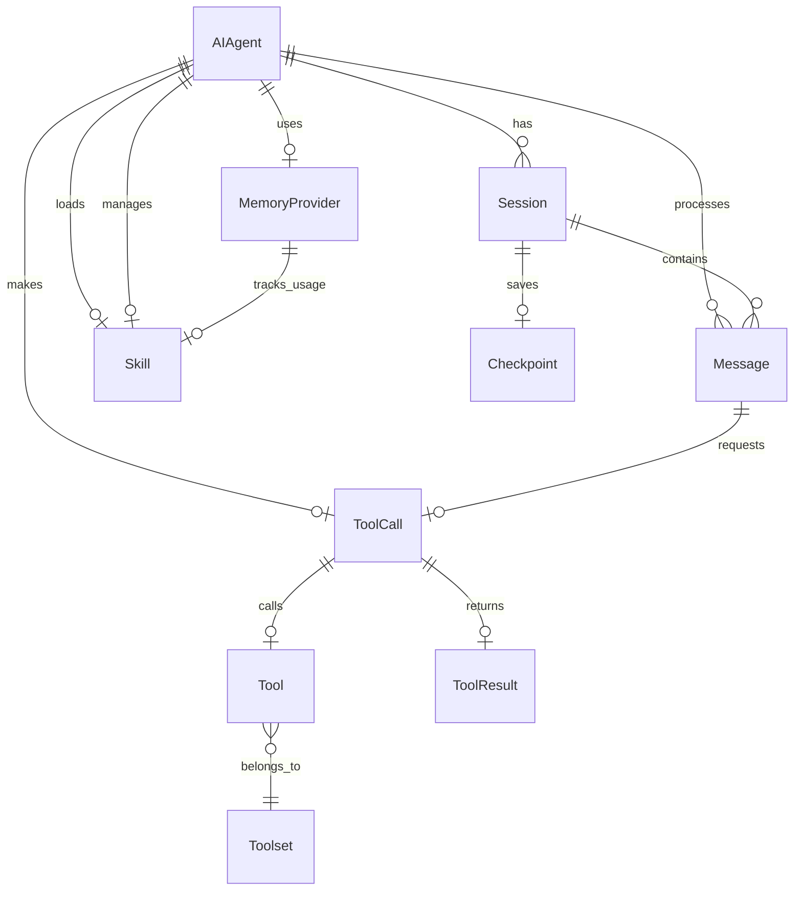
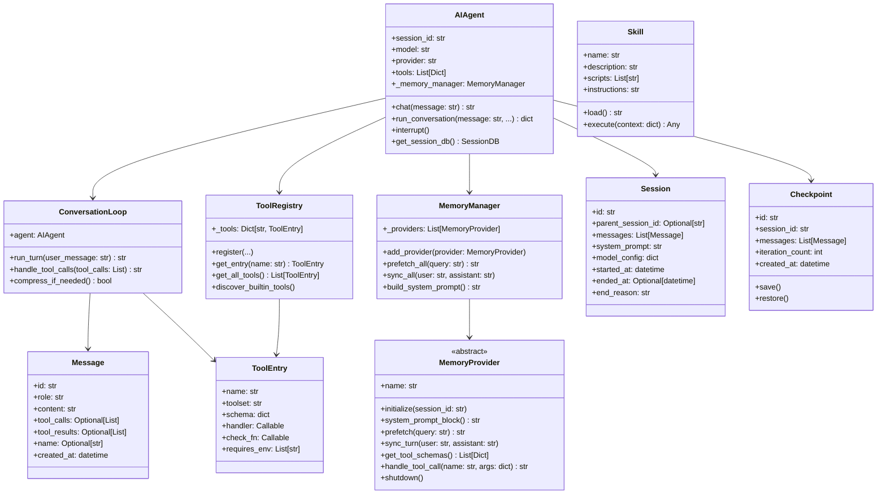
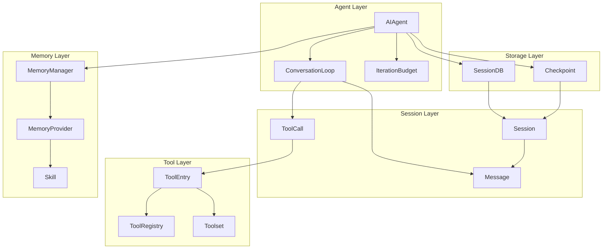

# 第四部分：核心对象模型分析

## 4.1 核心对象列表

| 对象 | 文件 | 职责 |
|-----|------|------|
| `AIAgent` | run_agent.py | Agent 主类，协调所有组件 |
| `Session` | hermes_state.py | 会话持久化单元 |
| `Message` | run_agent.py | 对话消息 |
| `Tool` | tools/registry.py | 工具抽象 |
| `ToolCall` | run_agent.py | 工具调用请求 |
| `ToolResult` | model_tools.py | 工具执行结果 |
| `MemoryProvider` | agent/memory_provider.py | 记忆提供者接口 |
| `Skill` | tools/skills_hub.py | 技能定义 |
| `Plan` | agent/conversation_loop.py | 执行计划（隐式） |
| `Checkpoint` | tools/checkpoint_manager.py | 任务检查点 |
| `IterationBudget` | agent/iteration_budget.py | 迭代预算控制 |

## 4.2 ER 图



## 4.3 类图



## 4.4 对象关系图



## 4.5 对象职责与生命周期

### 4.5.1 AIAgent

**职责**：Agent 主控制器，协调所有子系统完成用户任务。

**生命周期**：

```
创建 ──▶ 初始化 ──▶ 运行循环 ──▶ 结束/中断
         │
         ├── 加载配置
         ├── 创建 MemoryManager
         ├── 建立 Session 连接
         └── 注册工具
```

**状态变化**：

```python
class AIAgentState(Enum):
    IDLE = "idle"                    # 初始状态
    RUNNING = "running"              # 处理请求中
    WAITING_FOR_TOOL = "waiting"     # 等待工具执行
    WAITING_FOR_MODEL = "model"       # 等待 LLM 响应
    COMPRESSING = "compressing"      # 压缩上下文
    INTERRUPTED = "interrupted"      # 被中断
    COMPLETED = "completed"          # 完成
    ERROR = "error"                 # 错误
```

### 4.5.2 Session

**职责**：会话持久化单元，存储对话历史和元数据。

**生命周期**：

```
创建 ──▶ 活跃 ──▶ 完成/分支/压缩/超时
         │
         └── 保存消息
         └── 更新系统提示
```

**状态变化**：

```python
# end_reason 取值
class SessionEndReason(Enum):
    COMPLETED = "completed"      # 正常完成
    INTERRUPTED = "interrupted"  # 用户中断
    ERROR = "error"             # 错误结束
    TIMEOUT = "timeout"         # 超时
    BRANCHED = "branched"       # 分支
    COMPRESSION = "compression"  # 压缩
```

### 4.5.3 Message

**职责**：对话消息单元。

**生命周期**：

```
创建 ──▶ 发送 ──▶ 存储
         │
         └── 角色: system/user/assistant/tool
         └── 可选: tool_calls, tool_results
```

### 4.5.4 ToolEntry

**职责**：工具注册条目。

**生命周期**：

```
注册 ──▶ 可用 ──▶ 被调用 ──▶ 禁用/移除
          │
          └── schema 定义接口
          └── handler 实现逻辑
          └── check_fn 验证环境
```

### 4.5.5 MemoryProvider

**职责**：记忆提供者接口，封装不同记忆后端。

**生命周期**：

```
初始化 ──▶ 预热 ──▶ 同步循环 ──▶ 关闭
           │
           ├── 连接后端
           ├── 建立索引
           └── 加载配置
```

**支持的操作**：

```python
# 读取路径
prefetch(query) → str           # 预取相关记忆
system_prompt_block() → str     # 系统提示块

# 写入路径
sync_turn(user, assistant)      # 同步对话轮次

# 工具
get_tool_schemas() → List       # 暴露的工具
handle_tool_call(name, args)    # 处理工具调用
```

### 4.5.6 Skill

**职责**：可执行技能定义。

**生命周期**：

```
创建 ──▶ 加载 ──▶ 执行 ──▶ 改进 ──▶ 归档
         │
         └── SKILL.md 定义元数据
         └── scripts/ 包含脚本
         └── references/ 参考文档
```

### 4.5.7 Checkpoint

**职责**：任务状态快照，支持暂停/恢复。

**生命周期**：

```
创建快照 ──▶ 保存 ──▶ 恢复/过期
             │
             ├── 保存消息历史
             ├── 保存迭代计数
             └── 保存工具状态
```
