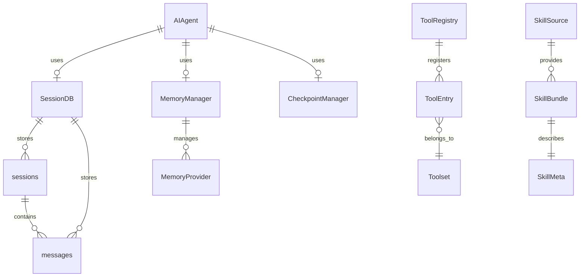
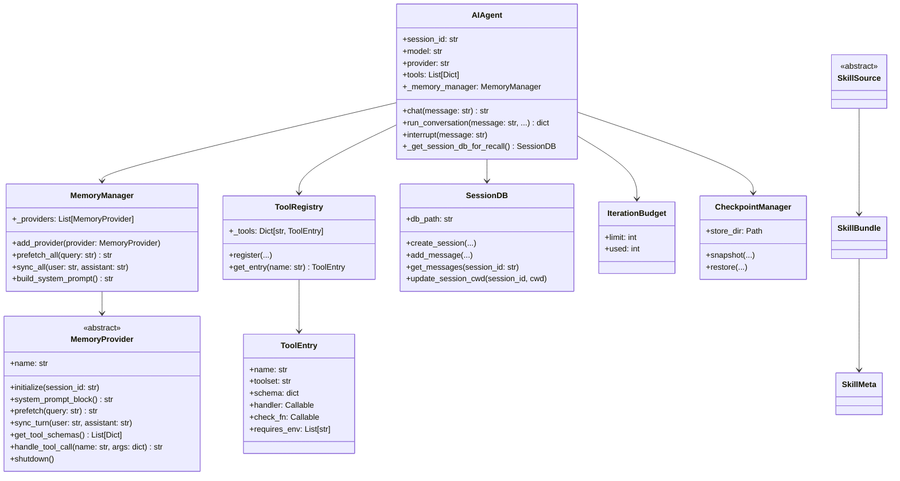
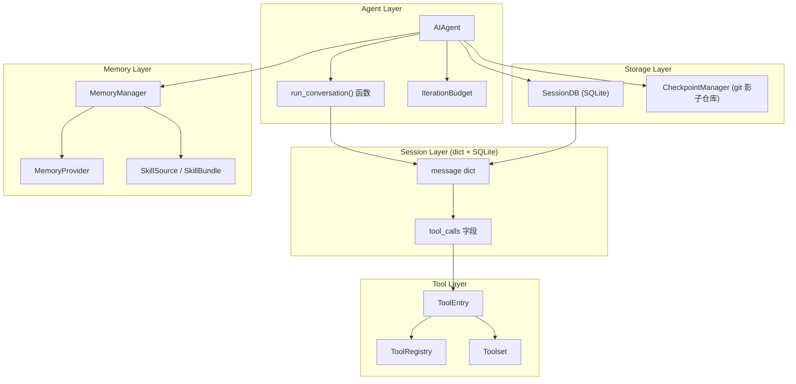

# 第四部分：核心对象模型分析

## 4.1 核心对象列表

> 重要说明：本系统大量使用**普通 dict** 而非 dataclass。消息、工具调用、工具结果均为 dict（或 dict 字段），不存在 `Message`/`ToolCall`/`ToolResult` 类。会话持久化由 `SessionDB`（SQLite）承担，不存在 `Session`/`SessionState` dataclass。下表仅列出**真实存在**的类/对象。

| 对象 | 文件 | 类型 | 职责 |
|-----|------|------|------|
| `AIAgent` | run_agent.py:333 | 类 | Agent 主类，协调所有组件 |
| `SessionDB` | hermes_state.py:667 | 类（SQLite） | 会话/消息持久化 |
| 消息 (message dict) | run_agent.py 等 | dict | `{"role":..,"content":..}`，含 `tool_calls`/`tool_call_id` 等字段 |
| `ToolEntry` / `ToolRegistry` | tools/registry.py:77 / :151 | 类 | 工具条目与注册中心（无名为 `Tool` 的类） |
| `MemoryProvider` | agent/memory_provider.py:43 | ABC | 记忆提供者接口 |
| `MemoryManager` | agent/memory_manager.py:314 | 类 | 记忆管理器 |
| `SkillMeta` / `SkillBundle` / `SkillSource` | tools/skills_hub.py:70/:84/:361 | 类 | 技能元数据/打包/来源（无名为 `Skill` 的类） |
| `CheckpointManager` | tools/checkpoint_manager.py:601 | 类 | 基于 git 影子仓库的工作目录文件快照（非消息/会话状态保存） |
| `IterationBudget` | agent/iteration_budget.py:17 | 类 | 迭代预算控制 |

## 4.2 ER 图

> 说明：`sessions` 与 `messages` 为 `SessionDB` 内的 SQLite 表；消息、工具调用/结果均为 dict 或表字段，非独立类。



## 4.3 类图

> 说明：下图仅含**真实类**。`ConversationLoop` 实为 `agent/conversation_loop.py` 的模块级函数 `run_conversation()`；消息为 dict，非 `Message` 类。



## 4.4 对象关系图



## 4.5 对象职责与生命周期

### 4.5.1 AIAgent

**职责**：Agent 主控制器，协调所有子系统完成用户任务。

**生命周期**：

```
创建 ──▶ 初始化 ──▶ 运行循环 ──▶ 结束/中断
         │
         ├── 加载配置
         ├── 创建 MemoryManager
         ├── 建立 SessionDB 连接
         └── 注册工具
```

**状态变化**：

> 说明：以下为**概念性状态模型**，代码中并不存在名为 `AIAgentState` 的字面 Enum。

```text
# 概念性状态（非代码中的 Enum）
IDLE              # 初始状态
RUNNING           # 处理请求中
WAITING_FOR_TOOL  # 等待工具执行
WAITING_FOR_MODEL # 等待 LLM 响应
COMPRESSING       # 压缩上下文
INTERRUPTED       # 被中断
COMPLETED         # 完成
ERROR             # 错误
```

### 4.5.2 SessionDB（会话持久化）

**职责**：通过 SQLite 持久化会话与消息，不存在 `Session`/`SessionState` dataclass。

**真实表结构**：

```sql
-- sessions 表（节选真实列）
CREATE TABLE sessions (
    id TEXT PRIMARY KEY,              -- 注意：TEXT 主键
    source TEXT NOT NULL,
    model TEXT,
    model_config TEXT,
    system_prompt TEXT,
    parent_session_id TEXT,
    started_at REAL NOT NULL,
    ended_at REAL,
    end_reason TEXT,
    input_tokens INTEGER, output_tokens INTEGER,  -- 计费/token 列
    cwd TEXT,                         -- 工作目录（非 workspace_cwd）
    title TEXT,
    archived INTEGER NOT NULL DEFAULT 0,
    ...
);

-- messages 表（节选真实列）
CREATE TABLE messages (
    id INTEGER PRIMARY KEY AUTOINCREMENT,  -- id，而非 rowid
    session_id TEXT NOT NULL,
    role TEXT NOT NULL,
    content TEXT,
    tool_call_id TEXT,
    tool_calls TEXT,
    tool_name TEXT,                   -- 无 name 列
    timestamp REAL NOT NULL,          -- 无 tool_results 列
    ...
);
```

> 说明：`end_reason` 为普通文本列，代码中**不存在** `SessionEndReason` Enum。常见取值（completed/interrupted/error/timeout/branched/compression）仅为约定值。

### 4.5.3 消息 (message dict)

**职责**：对话消息单元，为**普通 dict**，非 `Message` 类。

```
创建 ──▶ 发送 ──▶ 存入 messages 表
         │
         └── 角色: system/user/assistant/tool
         └── 可选字段: tool_calls, tool_call_id, tool_name
```

### 4.5.4 ToolEntry

**职责**：工具注册条目。

**生命周期**：

```
注册 ──▶ 可用 ──▶ 被调用 ──▶ 禁用/移除
          │
          └── schema 定义接口
          └── handler 实现逻辑
          └── check_fn 验证环境
```

### 4.5.5 MemoryProvider

**职责**：记忆提供者接口，封装不同记忆后端。

**生命周期**：

```
初始化 ──▶ 预热 ──▶ 同步循环 ──▶ 关闭
           │
           ├── 连接后端
           ├── 建立索引
           └── 加载配置
```

**支持的操作**：

```python
# 读取路径
prefetch(query) → str           # 预取相关记忆
system_prompt_block() → str     # 系统提示块

# 写入路径
sync_turn(user, assistant)      # 同步对话轮次

# 工具
get_tool_schemas() → List       # 暴露的工具
handle_tool_call(name, args)    # 处理工具调用
```

### 4.5.6 技能 (SkillMeta / SkillBundle / SkillSource)

**职责**：技能的元数据与来源抽象。代码中**不存在** `Skill` 类；真实类型为 `tools/skills_hub.py` 中的 `SkillMeta`（70）、`SkillBundle`（84）与 `SkillSource`（361，ABC，含 GitHubSource/UrlSource/SkillsShSource 等子类）。

**生命周期**：

```
来源解析 ──▶ 打包 (SkillBundle) ──▶ 元数据 (SkillMeta) ──▶ 加载/使用
         │
         └── SKILL.md 定义元数据
         └── scripts/ 包含脚本
         └── references/ 参考文档
```

### 4.5.7 CheckpointManager

**职责**：基于 **git 影子仓库**的工作目录文件快照系统（`tools/checkpoint_manager.py:601`）。在文件改动前通过一个共享的 bare git store 对工作目录文件做快照，**并非**保存消息或会话状态。

**生命周期**：

```
文件改动前快照 ──▶ 写入共享 git store ──▶ 按需恢复工作目录文件
                 │
                 ├── git objects 去重（跨项目共享）
                 ├── 每项目独立 git index
                 └── 仅快照工作目录文件，不含会话/消息
```
