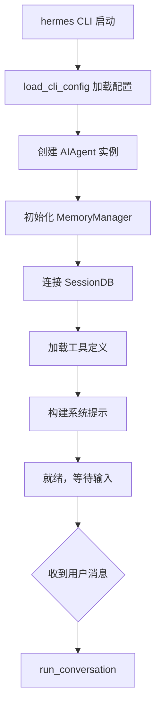
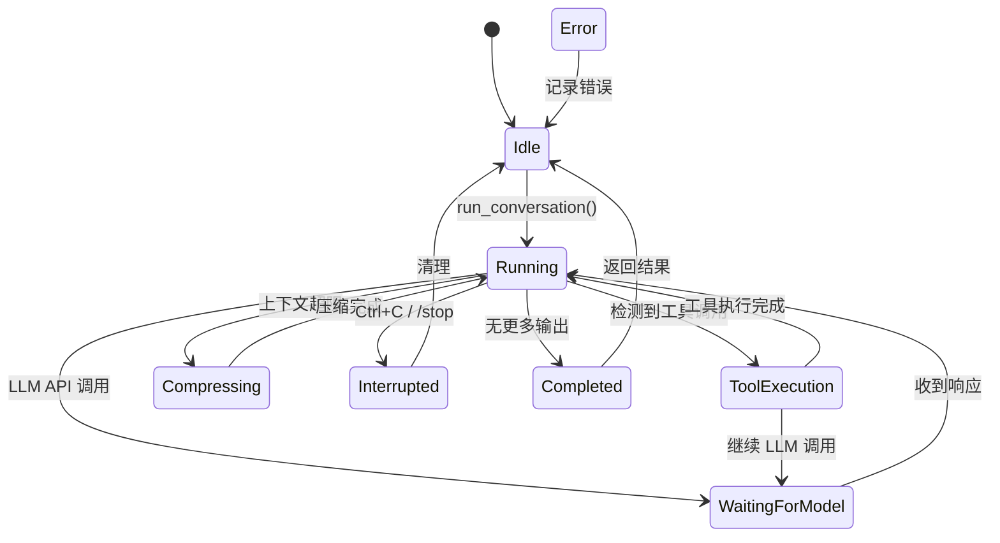
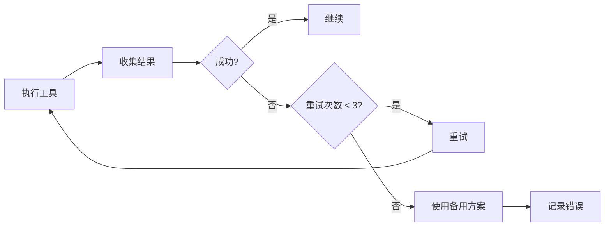
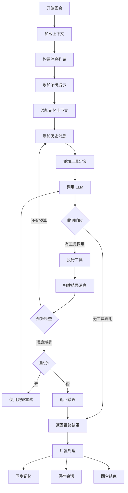
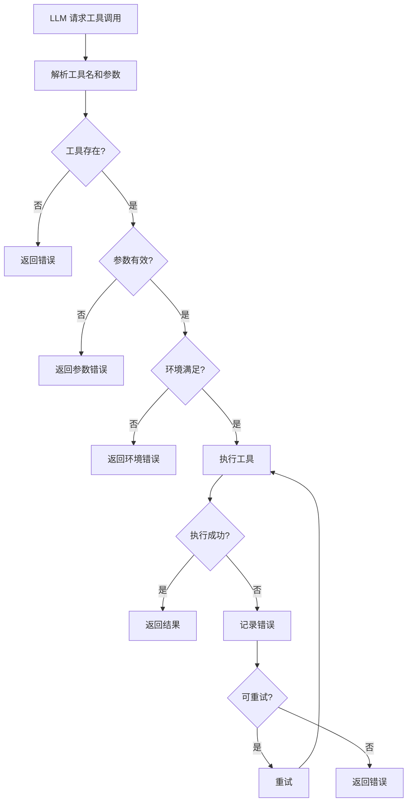

# 第五部分：Agent 运行机制分析

## 5.1 Agent 启动流程



## 5.2 主循环状态机



## 5.3 核心运行机制

### 5.3.1 ReAct 模式

Hermes Agent 采用 **ReAct (Reasoning + Acting)** 模式：

```python
# 伪代码展示 ReAct 循环
while iterations < max_iterations:
    # 1. Reason - 生成推理
    response = llm.chat(messages)
    
    # 2. Act - 如果有工具调用则执行
    if response.tool_calls:
        for call in response.tool_calls:
            result = execute_tool(call.name, call.args)
            messages.append(tool_result(result))
    else:
        # 没有工具调用，直接返回
        return response.content
```

### 5.3.2 Plan-Execute 模式

对于复杂任务，支持 **Plan-Execute** 模式：

```python
# 子 Agent 委托实现计划执行
result = delegate_task(
    goal="分析代码库并生成报告",
    context="需要分析的文件列表...",
    role="orchestrator"  # 可再分派
)
```

### 5.3.3 Reflection 机制



### 5.3.4 迭代控制

```python
class IterationBudget:
    def __init__(self, max_iterations: int = 90):
        self.max_iterations = max_iterations
        self.remaining = max_iterations
    
    def consume(self, n=1) -> bool:
        """消耗迭代次数，返回是否还有剩余"""
        if self.remaining >= n:
            self.remaining -= n
            return True
        return False
    
    def grace_call(self) -> bool:
        """最后宽限一次调用"""
        if self.remaining <= 0:
            self.remaining = -1  # 允许一次
            return True
        return False
```

## 5.4 Sequence Diagram - 完整对话流程

```mermaid
sequenceDiagram
    participant U as User
    participant CLI as CLI/TUI
    participant AG as AIAgent
    participant LOOP as ConversationLoop
    participant MEM as MemoryManager
    participant TOOL as ToolRegistry
    participant LLM as LLM Provider
    participant DB as SessionDB

    U->>CLI: 用户消息
    CLI->>AG: run_conversation(message)
    
    Note over AG: 1. 前置准备
    
    AG->>MEM: prefetch_all(query)
    MEM-->>AG: memory_context
    AG->>LOOP: build_turn_context()
    
    Note over LOOP: 2. 构建消息列表
    
    LOOP->>DB: get_session_messages()
    DB-->>LOOP: messages[]
    LOOP->>LOOP: build_system_prompt()
    LOOP->>LOOP: build_context_files()
    
    Note over LOOP: 3. LLM 调用循环
    
    LOOP->>LLM: chat.completions.create()
    LLM-->>LOOP: response
    
    alt 有工具调用
        LOOP->>LOOP: handle_tool_calls()
        LOOP->>TOOL: handle_function_call()
        TOOL->>TOOL: execute_tool()
        TOOL-->>LOOP: result
        LOOP->>LOOP: append result to messages
        LOOP->>LOOP: 继续 LLM 调用
    else 无工具调用
        LOOP-->>AG: final_response
    end
    
    Note over AG: 4. 后置处理
    
    AG->>MEM: sync_all(user, assistant)
    AG->>MEM: queue_prefetch()
    AG->>DB: save_messages()
    
    AG-->>CLI: result
    CLI-->>U: 显示响应
```

## 5.5 Loop 流程图



## 5.6 失败恢复机制

```python
class TurnRetryState:
    """单轮重试状态"""
    
    def __init__(self):
        self.attempt = 0
        self.last_error: Optional[str] = None
        self.fallback_reason: Optional[FailoverReason] = None
    
    def should_retry(self, max_retries=3) -> bool:
        return self.attempt < max_retries
    
    def record_failure(self, error: str, reason: FailoverReason):
        self.attempt += 1
        self.last_error = error
        self.fallback_reason = reason

# 错误分类
class FailoverReason(Enum):
    RATE_LIMIT = "rate_limit"
    CONTEXT_OVERFLOW = "context_overflow"
    MODEL_ERROR = "model_error"
    TIMEOUT = "timeout"
    AUTH_ERROR = "auth_error"
```

## 5.7 上下文压缩触发条件

```python
def should_compress(agent) -> bool:
    """判断是否需要压缩上下文"""
    
    # 1. Token 数量检查
    total_tokens = estimate_messages_tokens(messages)
    if total_tokens > agent.context_length * 0.85:
        return True
    
    # 2. 消息数量检查
    if len(messages) > 50:
        return True
    
    # 3. 工具调用次数检查
    tool_calls = count_tool_calls(messages)
    if tool_calls > 30:
        return True
    
    return False
```

## 5.8 工具执行流程


