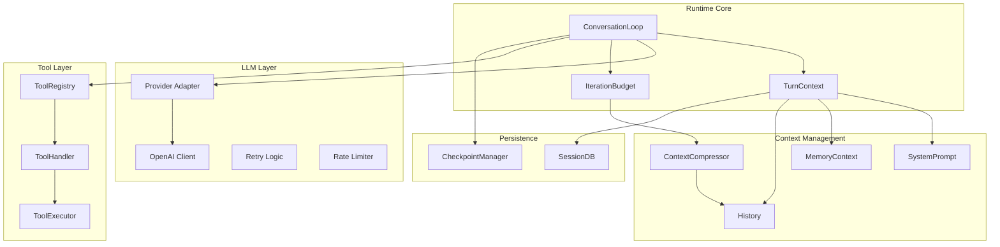
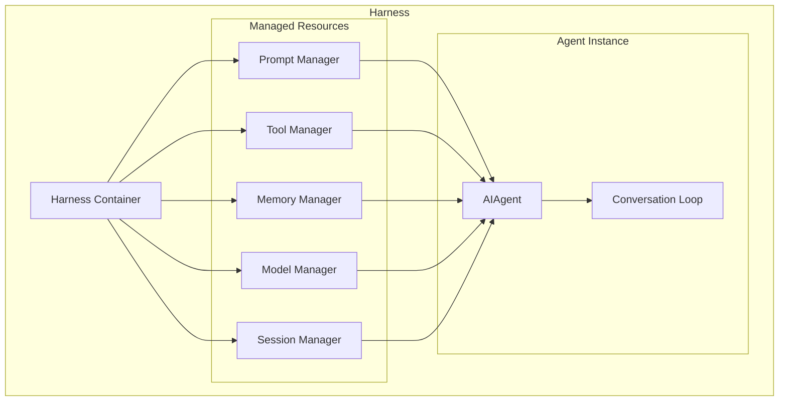
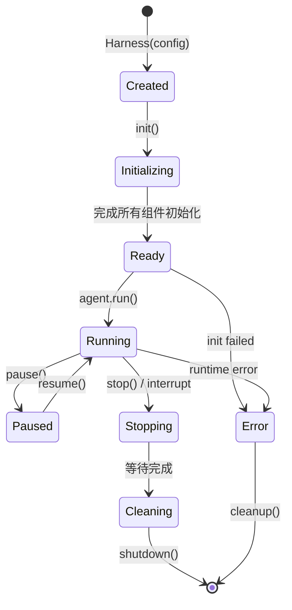

# 第六部分：Runtime 分析

## 6.1 Runtime 职责

Runtime 负责管理 Agent 的运行时环境，包括：

| 职责 | 实现 | 说明 |
|-----|------|-----|
| **上下文管理** | `turn_context.py` | 构建、持久化上下文 |
| **Token 管理** | `model_metadata.py` | Token 计数、限制 |
| **模型调用** | `chat_completion_helpers.py` | 多 Provider 适配 |
| **事件循环** | `conversation_loop.py` | 对话循环核心 |
| **任务调度** | `cron/scheduler.py` | 定时任务 |
| **并发机制** | `ThreadPoolExecutor` | 子 Agent 并行 |
| **取消机制** | `interrupt.py` | 信号中断 |
| **恢复机制** | `checkpoint_manager.py` | 检查点恢复 |

## 6.2 运行时架构图



## 6.3 上下文管理详解

```python
# 上下文构建流程 (agent/turn_context.py)
def build_turn_context(agent, user_message: str) -> List[Dict]:
    messages = []
    
    # 1. 系统提示
    messages.append({
        "role": "system",
        "content": agent._cached_system_prompt
    })
    
    # 2. 记忆上下文
    memory_block = build_memory_context_block(agent, user_message)
    if memory_block:
        messages.append({
            "role": "system", 
            "content": memory_block,
            "name": "memory_context"
        })
    
    # 3. 上下文文件
    context_files = build_context_files_prompt(agent)
    if context_files:
        messages.append({
            "role": "system",
            "content": context_files,
            "name": "context_files"
        })
    
    # 4. 技能说明
    skills_block = build_skills_system_prompt(agent)
    if skills_block:
        messages.append({
            "role": "system",
            "content": skills_block,
            "name": "skills"
        })
    
    # 5. 历史消息
    messages.extend(agent.conversation_history)
    
    # 6. 用户消息
    messages.append({
        "role": "user",
        "content": user_message
    })
    
    return messages
```

## 6.4 Token 管理

```python
class TokenManager:
    def __init__(self, context_length: int):
        self.context_length = context_length
        self.max_output_tokens = 4096
    
    def estimate_request_tokens(self, messages: List[Dict]) -> int:
        """粗略估算请求 Token"""
        # 使用 tiktoken 或估算
        return sum(estimate_tokens(msg) for msg in messages)
    
    def get_available_input_tokens(self) -> int:
        """可用输入 Token"""
        return self.context_length - self.max_output_tokens
    
    def should_compress(self, messages: List[Dict]) -> bool:
        """判断是否需要压缩"""
        total = self.estimate_request_tokens(messages)
        return total > self.get_available_input_tokens() * 0.85
```

---

# 第七部分：Harness 分析

## 7.1 Harness 概念

在 Hermes Agent 中，**Harness** 是管理 Agent 运行环境的抽象概念：

```python
# Harness 的核心职责
class Harness:
    """Agent 运行环境的容器"""
    
    def __init__(self, config: dict):
        self.config = config
        self.prompt_manager = PromptManager()
        self.tool_manager = ToolManager()
        self.memory_manager = MemoryManager()
        self.model_manager = ModelManager()
        self.session_manager = SessionManager()
```

## 7.2 为什么需要 Harness

```
┌──────────────────────────────────────────────────────────────┐
│                     为什么需要 Harness                          │
├──────────────────────────────────────────────────────────────┤
│ 1. 环境隔离 - 不同配置/会话之间相互独立                          │
│ 2. 资源管理 - 统一管理 Prompt、Tool、Memory、Model             │
│ 3. 生命周期 - 统一的初始化和清理逻辑                           │
│ 4. 可测试性 - 便于 Mock 和替换组件                             │
│ 5. 扩展性 - 新增组件不影响现有结构                             │
└──────────────────────────────────────────────────────────────┘
```

## 7.3 Harness 架构图



## 7.4 Harness 生命周期



## 7.5 资源管理详解

### 7.5.1 Prompt 管理

```python
class PromptManager:
    """管理系统提示构建"""
    
    def __init__(self):
        self._cached_prompts = {}
        self._prompt_builders = {}
    
    def register_builder(self, name: str, builder: Callable):
        self._prompt_builders[name] = builder
    
    def build(self, session_id: str) -> str:
        """构建系统提示（带缓存）"""
        if session_id in self._cached_prompts:
            return self._cached_prompts[session_id]
        
        parts = []
        for builder in self._prompt_builders.values():
            part = builder()
            if part:
                parts.append(part)
        
        prompt = "\n\n".join(parts)
        self._cached_prompts[session_id] = prompt
        return prompt
    
    def invalidate(self, session_id: str):
        """使缓存失效"""
        self._cached_prompts.pop(session_id, None)
```

### 7.5.2 Tool 管理

```python
class ToolManager:
    """管理工具定义和可用性"""
    
    def __init__(self):
        self._registry = ToolRegistry()
        self._enabled_toolsets = set()
    
    def enable_toolset(self, name: str):
        self._enabled_toolsets.add(name)
    
    def disable_toolset(self, name: str):
        self._enabled_toolsets.discard(name)
    
    def get_tools(self) -> List[Dict]:
        """获取当前启用的工具定义"""
        all_tools = self._registry.get_all_tools()
        return [
            t for t in all_tools
            if t.toolset in self._enabled_toolsets
            and self._registry.check_availability(t)
        ]
```

### 7.5.3 Memory 管理

```python
class MemoryManager:
    """管理记忆提供者和上下文"""
    
    def __init__(self):
        self._providers: List[MemoryProvider] = []
        self._builtin = BuiltinMemoryProvider()
    
    def add_provider(self, provider: MemoryProvider):
        """添加外部记忆提供者"""
        self._providers.append(provider)
    
    def prefetch_all(self, query: str) -> str:
        """从所有提供者预取"""
        blocks = []
        for p in self._providers:
            block = p.prefetch(query)
            if block:
                blocks.append(block)
        return "\n\n".join(blocks)
    
    def sync_all(self, user: str, assistant: str):
        """同步到所有提供者"""
        for p in self._providers:
            p.sync_turn(user, assistant)
```

### 7.5.4 Model 管理

```python
class ModelManager:
    """管理模型配置和客户端"""
    
    def __init__(self):
        self._providers = {}
        self._current_provider = None
        self._current_model = None
    
    def register_provider(self, name: str, adapter):
        self._providers[name] = adapter
    
    def set_model(self, provider: str, model: str):
        self._current_provider = self._providers[provider]
        self._current_model = model
    
    def get_client(self):
        return self._current_provider.get_client(self._current_model)
```

## 7.6 Session 管理

```python
class SessionManager:
    """管理会话状态和持久化"""
    
    def __init__(self, db_path: str):
        self.db = SessionDB(db_path)
        self._active_sessions = {}
    
    def create_session(self, session_id: str, config: dict) -> Session:
        session = Session(session_id, config)
        self._active_sessions[session_id] = session
        self.db.create_session(session)
        return session
    
    def get_session(self, session_id: str) -> Optional[Session]:
        return self._active_sessions.get(session_id) \
            or self.db.get_session(session_id)
    
    def save_session(self, session: Session):
        self.db.save_session(session)
    
    def list_sessions(self, limit=50) -> List[Session]:
        return self.db.list_sessions(limit)
```
