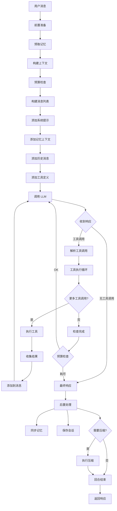
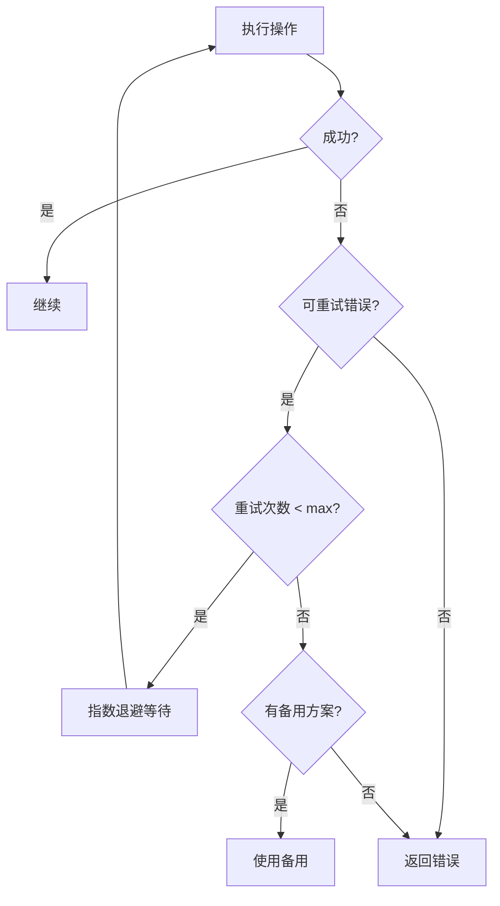
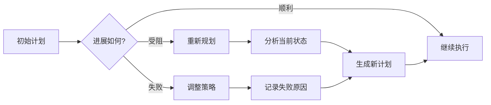
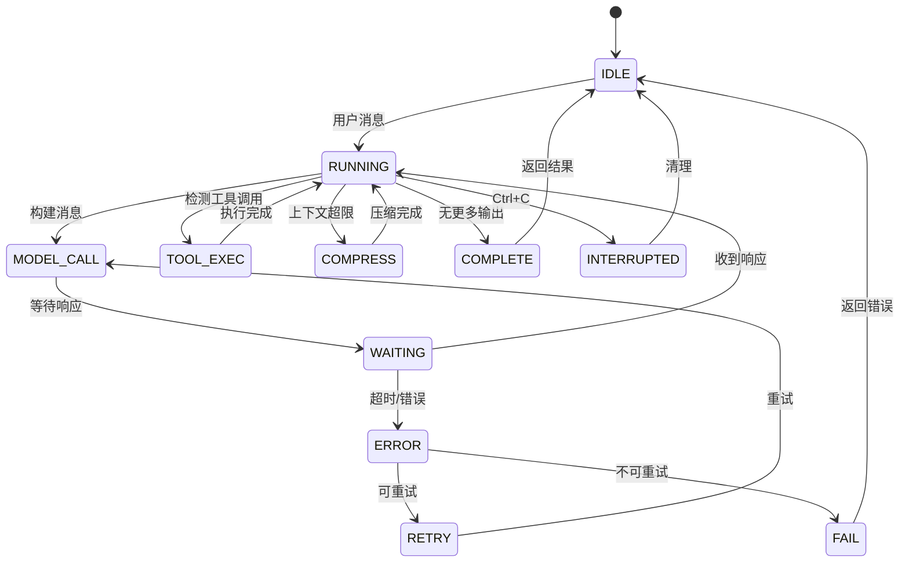

# 第八部分：Loop Engineering 分析

## 8.1 Loop 结构概述

Hermes Agent 的对话循环是其核心，执行以下步骤：

```
┌─────────────────────────────────────────────────────────────────┐
│                      Conversation Loop                            │
├─────────────────────────────────────────────────────────────────┤
│  1. 前置准备                                                     │
│     - 预取记忆                                                    │
│     - 构建上下文                                                  │
│     - Token 预算检查                                              │
│                                                                  │
│  2. LLM 调用                                                     │
│     - 构建消息列表                                                │
│     - 调用模型 API                                                │
│     - 处理响应                                                    │
│                                                                  │
│  3. 工具执行（如果需要）                                         │
│     - 解析工具调用                                                │
│     - 执行工具                                                    │
│     - 收集结果                                                    │
│                                                                  │
│  4. 后置处理                                                     │
│     - 同步记忆                                                    │
│     - 保存会话                                                    │
│     - 上下文压缩检查                                              │
└─────────────────────────────────────────────────────────────────┘
```

## 8.2 Loop 流程图



## 8.3 循环触发条件

| 条件 | 说明 | 处理方式 |
|-----|------|---------|
| **新用户消息** | 用户发送消息 | 开始新回合 |
| **工具调用** | LLM 请求工具 | 执行工具后继续 |
| **继续生成** | 模型未完成 | 继续调用 |
| **压缩触发** | Token 超限 | 执行压缩后继续 |
| **恢复检查点** | 重新加载状态 | 恢复到检查点 |

## 8.4 终止条件

```python
# 终止条件检查
def should_terminate(response, budget, error=None) -> bool:
    """判断是否应该终止循环"""
    
    # 1. 明确终止：没有工具调用
    if not response.tool_calls and response.content:
        return True
    
    # 2. 预算耗尽
    if not budget.remaining > 0:
        return True
    
    # 3. 错误终止
    if error and isinstance(error, FatalError):
        return True
    
    # 4. 用户中断
    if is_interrupted():
        return True
    
    return False
```

## 8.5 失败重试机制



```python
class RetryConfig:
    def __init__(self):
        self.max_retries = 3
        self.base_delay = 1.0  # 秒
        self.max_delay = 60.0
        self.exponential_base = 2
    
    def get_delay(self, attempt: int) -> float:
        """指数退避"""
        delay = self.base_delay * (self.exponential_base ** attempt)
        return min(delay, self.max_delay)

# 错误分类与重试策略
RETRYABLE_ERRORS = {
    "rate_limit": {"retry": True, "backoff": True},
    "timeout": {"retry": True, "backoff": False},
    "server_error": {"retry": True, "backoff": True},
    "auth_error": {"retry": False, "backoff": False},
    "context_overflow": {"retry": True, "backoff": False, "action": "compress"},
}
```

## 8.6 错误恢复策略

| 错误类型 | 恢复策略 | 详细说明 |
|---------|---------|---------|
| **Rate Limit** | 退避重试 | 指数退避等待 |
| **Timeout** | 快速重试 | 短暂等待后重试 |
| **Server Error** | 有限重试 | 3次后切换 Provider |
| **Auth Error** | 不重试 | 提示用户检查配置 |
| **Context Overflow** | 压缩后重试 | 先压缩再重试 |
| **Tool Error** | 报告结果 | 返回错误给 LLM |

## 8.7 反思机制

Hermes Agent 通过多种方式实现反思能力：

### 8.7.1 工具结果分类

```python
# 工具结果分类 (agent/tool_result_classification.py)
class ToolResultClassifier:
    """对工具执行结果进行分类"""
    
    def classify(self, tool_name: str, result: str) -> str:
        """分类工具结果"""
        if self._is_success(result):
            return "success"
        elif self._is_partial(result):
            return "partial"
        elif self._is_error(result):
            return "error"
        else:
            return "unknown"
    
    def needs_retry(self, classification: str) -> bool:
        return classification in ("partial", "unknown")
```

### 8.7.2 错误分类 (agent/error_classifier.py)

```python
class ErrorClassifier:
    """分类 API 错误并决定恢复策略"""
    
    def classify(self, error: Exception) -> FailoverReason:
        if "rate_limit" in str(error).lower():
            return FailoverReason.RATE_LIMIT
        elif "context" in str(error).lower():
            return FailoverReason.CONTEXT_OVERFLOW
        elif "auth" in str(error).lower():
            return FailoverReason.AUTH_ERROR
        elif "timeout" in str(error).lower():
            return FailoverReason.TIMEOUT
        else:
            return FailoverReason.UNKNOWN
```

## 8.8 长任务机制

对于长时间运行的任务，Hermes 提供：

### 8.8.1 后台执行

```python
# terminal_tool.py 支持后台执行
result = terminal(
    command="long-running-script.sh",
    background=True,
    notify_on_complete=True
)
```

### 8.8.2 检查点保存

```python
# checkpoint_manager.py
class CheckpointManager:
    def save_checkpoint(self, session_id: str):
        """保存检查点"""
        checkpoint = {
            "session_id": session_id,
            "messages": self.get_messages(),
            "iteration": self.get_iteration(),
            "timestamp": time.time(),
        }
        self.db.save_checkpoint(checkpoint)
    
    def restore(self, checkpoint_id: str):
        """恢复到检查点"""
        checkpoint = self.db.get_checkpoint(checkpoint_id)
        self.set_messages(checkpoint["messages"])
        self.set_iteration(checkpoint["iteration"])
```

## 8.9 计划更新机制



## 8.10 Loop 状态机


