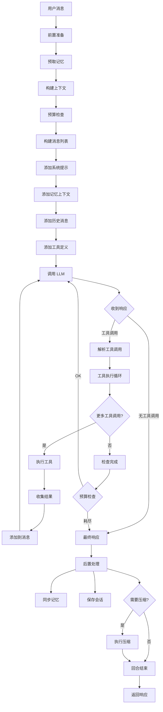
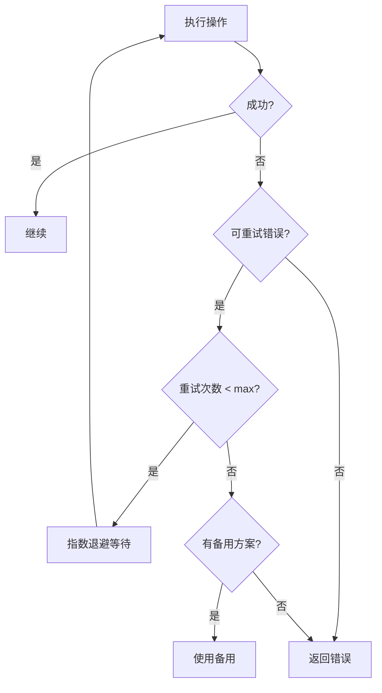
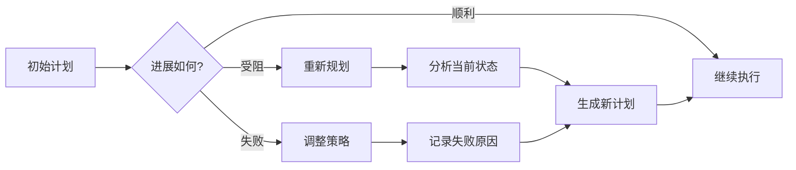
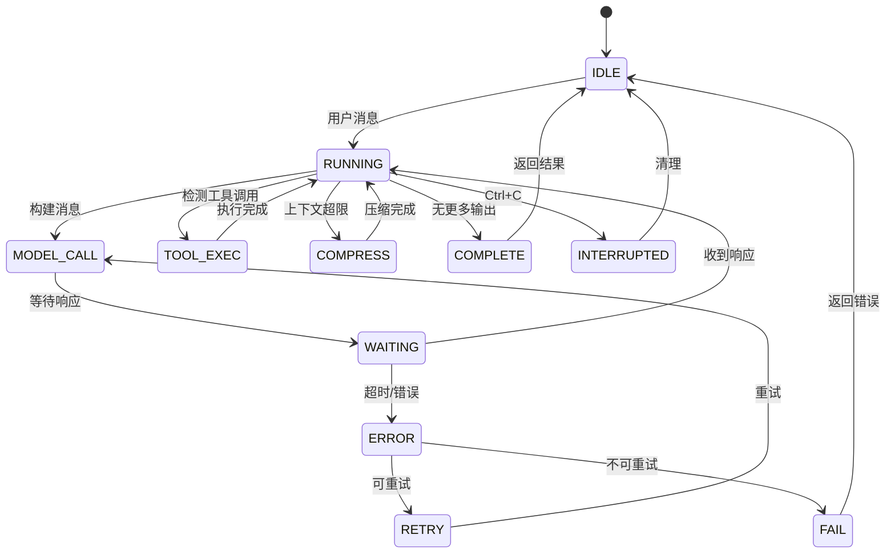

# 第八部分：Loop Engineering 分析

## 8.1 Loop 结构概述

Hermes Agent 的对话循环以一个**模块级函数** `run_conversation(agent, ...)` 为入口
（位于 `agent/conversation_loop.py:495`）。需要强调：`conversation_loop.py` 是一个约
4582 行、由一组函数组成的模块，而**不是**一个类 / 状态机对象——循环逻辑通过函数之间的
调用与显式状态参数驱动，而非一个集中持有状态的对象。该入口函数执行以下步骤：

```
┌─────────────────────────────────────────────────────────────────┐
│                      Conversation Loop                            │
├─────────────────────────────────────────────────────────────────┤
│  1. 前置准备                                                     │
│     - 预取记忆                                                    │
│     - 构建上下文                                                  │
│     - Token 预算检查                                              │
│                                                                  │
│  2. LLM 调用                                                     │
│     - 构建消息列表                                                │
│     - 调用模型 API                                                │
│     - 处理响应                                                    │
│                                                                  │
│  3. 工具执行（如果需要）                                         │
│     - 解析工具调用                                                │
│     - 执行工具                                                    │
│     - 收集结果                                                    │
│                                                                  │
│  4. 后置处理                                                     │
│     - 同步记忆                                                    │
│     - 保存会话                                                    │
│     - 上下文压缩检查                                              │
└─────────────────────────────────────────────────────────────────┘
```

## 8.2 Loop 流程图



## 8.3 循环触发条件

| 条件 | 说明 | 处理方式 |
|-----|------|---------|
| **新用户消息** | 用户发送消息 | 开始新回合 |
| **工具调用** | LLM 请求工具 | 执行工具后继续 |
| **继续生成** | 模型未完成 | 继续调用 |
| **压缩触发** | Token 超限 | 执行压缩后继续 |
| **恢复检查点** | 重新加载状态 | 恢复到检查点 |

## 8.4 终止条件

循环的终止并没有一个集中的 `should_terminate()` 函数（代码中不存在该符号）。
终止是由 `run_conversation()` 内部的控制流根据以下情形内联判断的：

| 终止情形 | 说明 |
|---------|------|
| **无工具调用的最终响应** | 模型返回了文本且不再请求工具，本回合自然结束 |
| **预算 / 迭代上限耗尽** | 达到 token 预算或最大迭代次数，停止继续调用 |
| **致命错误** | 经 `classify_api_error()` 判定为不可恢复（如 `auth_permanent`）时中止 |
| **用户中断** | 收到中断信号（如 Ctrl+C / 取消）后清理并退出 |

> 说明：上述判断分散在循环主体的条件分支中，下面用伪代码示意其语义，
> 但请注意这是**说明性伪代码**，并非真实存在的独立函数。

```python
# 说明性伪代码 —— 实际逻辑内联在 run_conversation() 中，无此独立函数
# 1. 明确终止：没有工具调用
if not response.tool_calls and response.content:
    ...  # 结束回合

# 2. 预算 / 迭代耗尽
if budget_exhausted or iteration >= max_iterations:
    ...  # 结束回合

# 3. 不可恢复错误（见 agent/error_classifier.py）
if classified.reason is FailoverReason.auth_permanent:
    ...  # 中止

# 4. 用户中断
if is_interrupted():
    ...  # 清理并退出
```

## 8.5 失败重试机制



```python
# 重试逻辑不在某个 `RetryConfig` 类中（代码中不存在该类），而是分布在：
#   - agent/retry_utils.py        : 退避 / 重试辅助函数
#   - agent/turn_retry_state.py   : 单回合的重试状态跟踪
# 退避与重试决策结合 agent/error_classifier.py 的分类结果共同进行。

# 错误分类与重试策略（FailoverReason 成员均为小写，见 error_classifier.py:24）
RETRYABLE_BEHAVIOR = {
    FailoverReason.rate_limit:       {"retry": True,  "backoff": True},
    FailoverReason.timeout:          {"retry": True,  "backoff": True},  # 重建 client 后重试
    FailoverReason.server_error:     {"retry": True,  "backoff": True},
    FailoverReason.overloaded:       {"retry": True,  "backoff": True},
    FailoverReason.auth:             {"retry": True,  "backoff": False}, # 先刷新/轮换凭证
    FailoverReason.auth_permanent:   {"retry": False, "backoff": False}, # 不可恢复，中止
    FailoverReason.context_overflow: {"retry": True,  "backoff": False, "action": "compress"},
}
```

## 8.6 错误恢复策略

| 错误类型 | 恢复策略 | 详细说明 |
|---------|---------|---------|
| **Rate Limit** | 退避重试 | 指数退避等待 |
| **Timeout** | 快速重试 | 短暂等待后重试 |
| **Server Error** | 有限重试 | 3次后切换 Provider |
| **Auth Error** | 不重试 | 提示用户检查配置 |
| **Context Overflow** | 压缩后重试 | 先压缩再重试 |
| **Tool Error** | 报告结果 | 返回错误给 LLM |

## 8.7 反思机制

Hermes Agent 通过多种方式实现反思能力：

### 8.7.1 工具结果分类

```python
# 工具结果分类 (agent/tool_result_classification.py)
# 该模块没有 ToolResultClassifier 类，只有一个模块级函数（:12）：
def file_mutation_result_landed(tool_name: str, result: Any) -> bool:
    """判断某次文件写入/修改类工具调用的结果是否"落地"成功。

    用于循环在文件变更后据此决定后续处理（例如反思/重试线索）。
    """
    ...
```

### 8.7.2 错误分类 (agent/error_classifier.py)

```python
# agent/error_classifier.py 中没有 ErrorClassifier 类。真实结构是：
#   - class FailoverReason(enum.Enum) (:24)  —— 失败原因枚举，成员全部小写
#   - class ClassifiedError            (:70)  —— 分类结果（dataclass）
#   - def classify_api_error(...)      (:441) —— 分类入口函数

class FailoverReason(enum.Enum):
    """为什么 API 调用失败 —— 决定恢复策略（成员均为小写）。"""
    auth = "auth"                          # 瞬时鉴权失败 (401/403) — 刷新/轮换
    auth_permanent = "auth_permanent"      # 刷新后仍失败 — 中止
    billing = "billing"                    # 402 / 额度耗尽 — 立即轮换
    rate_limit = "rate_limit"              # 429 / 限流 — 退避后轮换
    overloaded = "overloaded"              # 503/529 — 供应商过载，退避
    server_error = "server_error"          # 500/502 — 服务端错误，重试
    timeout = "timeout"                    # 连接/读取超时 — 重建 client 后重试
    context_overflow = "context_overflow"  # 上下文过大 — 压缩（而非 failover）
    payload_too_large = "payload_too_large"  # 413 — 压缩载荷
    image_too_large = "image_too_large"    # 单张图片超过供应商上限 — 缩小后重试
    model_not_found = "model_not_found"    # 404 / 无效模型 — 回退到其他模型
    content_policy_blocked = "content_policy_blocked"  # 安全过滤拒绝 — 不要原样重试
    thinking_signature = "thinking_signature"  # Anthropic thinking 块签名无效
    # ... 另有 format_error / unknown 等若干成员

# 入口函数（而非类方法）
def classify_api_error(...) -> ClassifiedError:
    """检查异常 / 响应，返回带 FailoverReason 的 ClassifiedError。"""
    ...
```

## 8.8 长任务机制

对于长时间运行的任务，Hermes 提供：

### 8.8.1 后台执行

```python
# terminal_tool.py 支持后台执行
result = terminal(
    command="long-running-script.sh",
    background=True,
    notify_on_complete=True
)
```

### 8.8.2 检查点（文件快照）

`tools/checkpoint_manager.py` 的 `CheckpointManager` (:601) **不是**用来保存消息 / 迭代
状态的，而是一个基于 **git 影子仓库（shadow repo）的文件检查点系统**：它用一个独立的
bare git 仓库为工作目录中的文件拍快照，从而支持回滚工作区文件改动。它与会话消息历史无关。

核心实现是一组模块级函数：

```python
# tools/checkpoint_manager.py
def _project_hash(working_dir: str) -> str: ...        # 由工作目录推导影子仓库标识 (:200)
def _init_shadow_repo(shadow_repo: Path, working_dir: str) -> Optional[str]: ...  # 初始化 bare 影子仓库 (:574)
def _run_git(...) -> ...: ...                          # 在影子仓库上执行 git 命令 (:297)
def _validate_commit_hash(commit_hash: str) -> Optional[str]: ...  # 校验提交哈希 (:157)

class CheckpointManager:  # (:601)
    """通过 git 影子仓库对工作目录文件进行快照 / 回滚（非消息状态）。"""
    ...
```

## 8.9 计划更新机制



## 8.10 Loop 状态机


