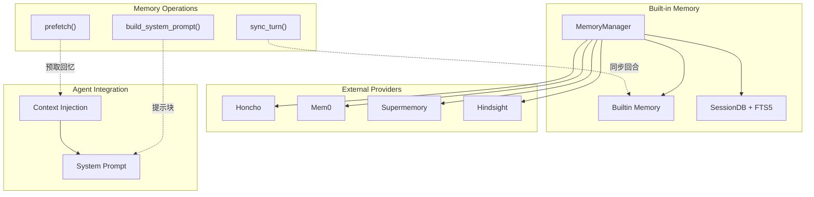
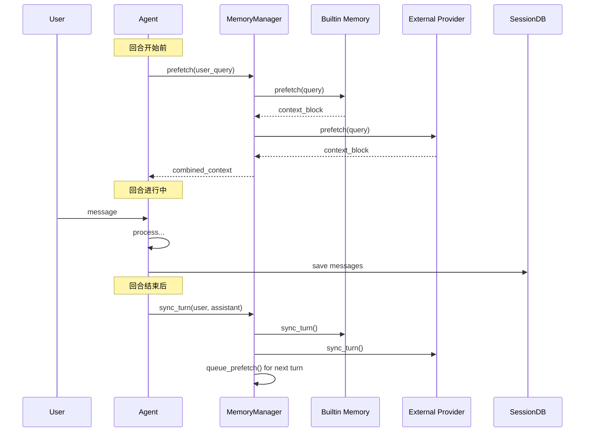
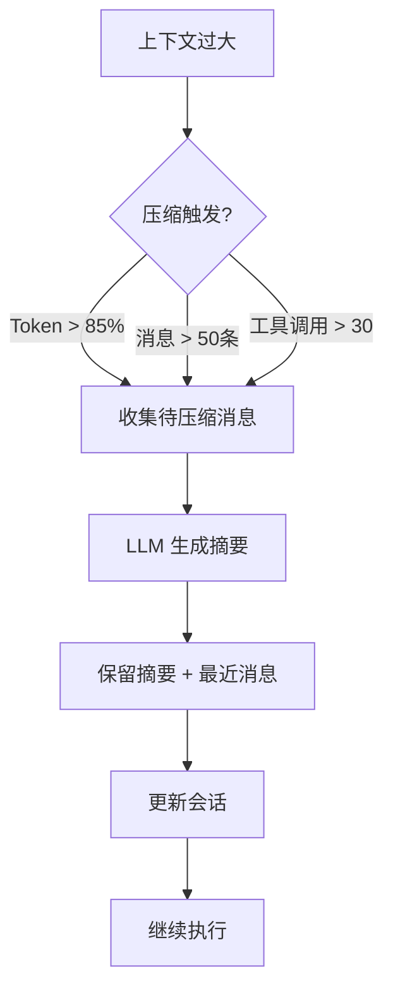

# 第九部分：Memory 系统分析

## 9.1 记忆层次架构

Hermes Agent 的记忆系统在概念上可分为三层（注意："层 / tier" 仅是本文用于说明的抽象描述，代码中并没有对应的 "tier" 术语或枚举）：

```
┌─────────────────────────────────────────────────────────────────┐
│                     Memory 层次架构                               │
├─────────────────────────────────────────────────────────────────┤
│                                                                  │
│  ┌──────────────────────────────────────────────────────────┐   │
│  │               Working Memory (工作记忆)                     │   │
│  │  • 当前对话上下文                                         │   │
│  │  • 活跃的技能和工具定义                                    │   │
│  │  • 最近的工具调用结果                                      │   │
│  │  • Token 预算                                             │   │
│  └──────────────────────────────────────────────────────────┘   │
│                              ▲                                   │
│                              │ 压缩/扩展                          │
│                              ▼                                   │
│  ┌──────────────────────────────────────────────────────────┐   │
│  │              Short-term Memory (短期记忆)                  │   │
│  │  • SessionDB 中的消息历史 (messages 表)                    │   │
│  │  • FTS5 全文索引 (messages_fts + messages_fts_trigram)     │   │
│  └──────────────────────────────────────────────────────────┘   │
│                              ▲                                   │
│                              │ 同步                              │
│                              ▼                                   │
│  ┌──────────────────────────────────────────────────────────┐   │
│  │              Long-term Memory (长期记忆)                    │   │
│  │  • 用户配置 (USER.md)                                     │   │
│  │  • 通用记忆 (MEMORY.md)                                   │   │
│  │  • 技能定义                                               │   │
│  │  • 外部提供者 (Honcho/Mem0/Supermemory)                  │   │
│  └──────────────────────────────────────────────────────────┘   │
│                                                                  │
└─────────────────────────────────────────────────────────────────┘
```

## 9.2 Memory 架构图



## 9.3 记忆数据流



## 9.4 核心接口

```python
# MemoryProvider ABC (agent/memory_provider.py)
class MemoryProvider(ABC):
    @property
    def name(self) -> str:
        """提供者名称"""
    
    @abstractmethod
    def is_available(self) -> bool:
        """是否可用"""
    
    @abstractmethod
    def initialize(self, session_id: str, **kwargs):
        """初始化"""
    
    def system_prompt_block(self) -> str:
        """系统提示块"""
        return ""
    
    @abstractmethod
    def prefetch(self, query: str, *, session_id: str = "") -> str:
        """预取相关记忆（session_id 为仅限关键字参数）"""
    
    def queue_prefetch(self, query: str, *, session_id: str = ""):
        """队列预取"""
    
    @abstractmethod
    def sync_turn(self, user_content: str, assistant_content: str, 
                   session_id: str = "", messages: List[Dict] = None):
        """同步回合"""
    
    @abstractmethod
    def get_tool_schemas(self) -> List[Dict]:
        """获取工具 schema"""
    
    def handle_tool_call(self, tool_name: str, args: Dict) -> str:
        """处理工具调用"""
        raise NotImplementedError
```

## 9.5 内置记忆工具

```python
# tools/memory_tool.py - 内置记忆存储
# 核心类是 MemoryStore (tools/memory_tool.py:113)，负责把记忆条目读写到磁盘上的
# MEMORY.md / USER.md 文件；记忆工具本身通过 registry.register(name="memory", ...)
# 在文件末尾 (:1072) 注册到工具表中。
class MemoryStore:
    """内置记忆条目存储（写入 MEMORY.md / USER.md）"""

    # target 是枚举: "memory"（通用记忆）或 "user"（用户记忆），定义于 :923
    def add(self, target: str, content: str) -> Dict[str, Any]: ...
    def replace(self, target: str, old_text: str, content: str) -> Dict[str, Any]: ...
    def remove(self, target: str, old_text: str) -> Dict[str, Any]: ...
    def save_to_disk(self, target: str): ...


# 单一 `memory` 工具，用 action 参数区分操作 (add / replace / remove)，
# 支持 batch 批量操作。简化后的 schema：
MEMORY_TOOL_SCHEMA = {
    "name": "memory",
    "description": "Add / replace / remove long-term memory entries",
    "parameters": {
        "type": "object",
        "properties": {
            "action":   {"type": "string", "enum": ["add", "replace", "remove"]},
            "target":   {"type": "string", "enum": ["memory", "user"]},
            "content":  {"type": "string", "description": "新条目内容 (add/replace)"},
            "old_text": {"type": "string", "description": "要替换/删除的现有文本"},
            "batch":    {"type": "array",  "description": "批量操作列表"},
        },
        "required": ["action"],
    },
}
```

## 9.6 FTS5 全文搜索

```sql
-- SessionDB 中的 FTS5 表 (hermes_state.py:612)
-- 这是一个 contentless（无外部内容表）的 FTS5 表，使用 DEFAULT tokenizer
-- （不是 porter/unicode61，也没有 content='messages' / content_rowid）。
-- 索引内容由 messages 表上的 INSERT/UPDATE/DELETE 触发器填充，
-- 索引文本 = content || tool_name || tool_calls。
CREATE VIRTUAL TABLE IF NOT EXISTS messages_fts USING fts5(
    content
);

-- 触发器示例：插入消息时同步写入 FTS（rowid 对齐 messages.id）
CREATE TRIGGER IF NOT EXISTS messages_fts_insert AFTER INSERT ON messages BEGIN
    INSERT INTO messages_fts(rowid, content) VALUES (
        new.id,
        COALESCE(new.content, '') || ' ' ||
        COALESCE(new.tool_name, '') || ' ' ||
        COALESCE(new.tool_calls, '')
    );
END;

-- 第二张 FTS 表：trigram 分词，用于 CJK（中日韩）子串搜索 (hermes_state.py:641)
-- 默认 unicode61 分词器会把 CJK 字符拆成单字，破坏短语匹配；trigram 分词器
-- 生成重叠的 3 字节序列，使任意脚本（CJK、泰文等）的子串查询都能原生工作。
CREATE VIRTUAL TABLE IF NOT EXISTS messages_fts_trigram USING fts5(
    content,
    tokenize='trigram'
);

-- 搜索语法（rowid 对应 messages.id）
SELECT m.* FROM messages m
JOIN messages_fts f ON m.id = f.rowid
WHERE messages_fts MATCH 'search query'
ORDER BY rank;
```

## 9.7 上下文压缩



```python
# 上下文压缩并非单一类，而是横跨多个模块协作完成：
#   - agent/context_compressor.py : class ContextCompressor(ContextEngine) (:612)
#                                    实际压缩入口 compress() 在 :2354
#   - agent/conversation_compression.py : 会话级压缩流程
#   - agent/context_engine.py            : ContextEngine 基类/上下文管理
#   - agent/memory_manager.py            : MemoryManager.on_pre_compress (:779)
#                                          在压缩前注入记忆摘要
class ContextCompressor(ContextEngine):
    def compress(
        self,
        messages: List[Dict[str, Any]],
        current_tokens: int = None,
        focus_topic: str = None,
        force: bool = False,
    ) -> List[Dict[str, Any]]:
        """压缩上下文。

        注意：真实实现并不是简单的 "保留最近 10 条 + 摘要其余"，
        具体的消息选择/摘要/裁剪策略由 ContextEngine 体系决定，
        这里仅示意其方法签名。
        """
        ...
```

## 9.8 SessionDB 结构

```sql
-- Sessions 表 (hermes_state.py:523) — 实际约有 30 个列，下面列出主要列
CREATE TABLE IF NOT EXISTS sessions (
    id TEXT PRIMARY KEY,
    source TEXT NOT NULL,
    user_id TEXT,
    model TEXT,
    model_config TEXT,        -- JSON
    system_prompt TEXT,
    parent_session_id TEXT,
    started_at REAL NOT NULL,
    ended_at REAL,
    end_reason TEXT,
    message_count INTEGER DEFAULT 0,
    tool_call_count INTEGER DEFAULT 0,
    input_tokens INTEGER DEFAULT 0,
    output_tokens INTEGER DEFAULT 0,
    cwd TEXT,                 -- 工作目录（注意列名是 cwd，不是 workspace_cwd）
    title TEXT,
    archived INTEGER NOT NULL DEFAULT 0,
    -- ... 另有 billing/cost/handoff/rewind 等若干列
    FOREIGN KEY (parent_session_id) REFERENCES sessions(id)
);

-- Messages 表 (hermes_state.py:560)
CREATE TABLE IF NOT EXISTS messages (
    id INTEGER PRIMARY KEY AUTOINCREMENT,   -- 主键是 id（不是 rowid）
    session_id TEXT NOT NULL REFERENCES sessions(id),
    role TEXT NOT NULL,
    content TEXT,
    tool_call_id TEXT,
    tool_calls TEXT,          -- JSON（注意：没有 tool_results 列，没有 name 列）
    tool_name TEXT,
    timestamp REAL NOT NULL,  -- 时间戳列名是 timestamp
    token_count INTEGER,
    finish_reason TEXT,
    active INTEGER NOT NULL DEFAULT 1,
    compacted INTEGER NOT NULL DEFAULT 0
    -- ... 另有 reasoning/codex/platform_message_id 等若干列
);

-- FTS5 索引（contentless，DEFAULT tokenizer；rowid 对齐 messages.id）
CREATE VIRTUAL TABLE IF NOT EXISTS messages_fts USING fts5(
    content
);
```
