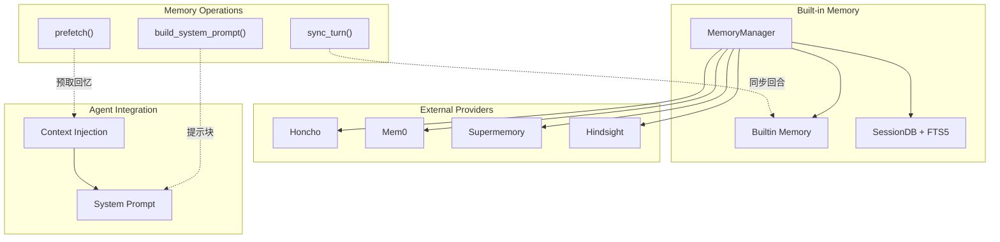
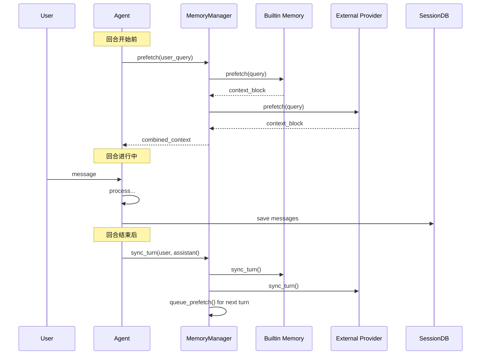
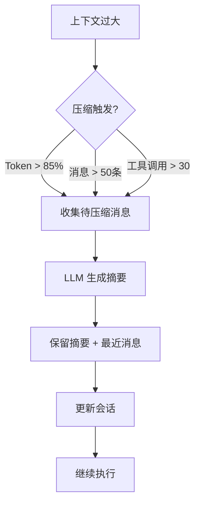

# 第九部分：Memory 系统分析

## 9.1 记忆层次架构

Hermes Agent 的记忆系统分为三层：

```
┌─────────────────────────────────────────────────────────────────┐
│                     Memory 层次架构                               │
├─────────────────────────────────────────────────────────────────┤
│                                                                  │
│  ┌──────────────────────────────────────────────────────────┐   │
│  │               Working Memory (工作记忆)                     │   │
│  │  • 当前对话上下文                                         │   │
│  │  • 活跃的技能和工具定义                                    │   │
│  │  • 最近的工具调用结果                                      │   │
│  │  • Token 预算                                             │   │
│  └──────────────────────────────────────────────────────────┘   │
│                              ▲                                   │
│                              │ 压缩/扩展                          │
│                              ▼                                   │
│  ┌──────────────────────────────────────────────────────────┐   │
│  │              Short-term Memory (短期记忆)                  │   │
│  │  • SessionDB 中的消息历史                                  │   │
│  │  • FTS5 全文索引                                          │   │
│  │  • Checkpoint 快照                                        │   │
│  └──────────────────────────────────────────────────────────┘   │
│                              ▲                                   │
│                              │ 同步                              │
│                              ▼                                   │
│  ┌──────────────────────────────────────────────────────────┐   │
│  │              Long-term Memory (长期记忆)                    │   │
│  │  • 用户配置 (USER.md)                                     │   │
│  │  • 通用记忆 (MEMORY.md)                                   │   │
│  │  • 技能定义                                               │   │
│  │  • 外部提供者 (Honcho/Mem0/Supermemory)                  │   │
│  └──────────────────────────────────────────────────────────┘   │
│                                                                  │
└─────────────────────────────────────────────────────────────────┘
```

## 9.2 Memory 架构图



## 9.3 记忆数据流



## 9.4 核心接口

```python
# MemoryProvider ABC (agent/memory_provider.py)
class MemoryProvider(ABC):
    @property
    def name(self) -> str:
        """提供者名称"""
    
    @abstractmethod
    def is_available(self) -> bool:
        """是否可用"""
    
    @abstractmethod
    def initialize(self, session_id: str, **kwargs):
        """初始化"""
    
    def system_prompt_block(self) -> str:
        """系统提示块"""
        return ""
    
    @abstractmethod
    def prefetch(self, query: str, session_id: str = "") -> str:
        """预取相关记忆"""
    
    def queue_prefetch(self, query: str, session_id: str = ""):
        """队列预取"""
    
    @abstractmethod
    def sync_turn(self, user_content: str, assistant_content: str, 
                   session_id: str = "", messages: List[Dict] = None):
        """同步回合"""
    
    @abstractmethod
    def get_tool_schemas(self) -> List[Dict]:
        """获取工具 schema"""
    
    def handle_tool_call(self, tool_name: str, args: Dict) -> str:
        """处理工具调用"""
        raise NotImplementedError
```

## 9.5 内置记忆工具

```python
# tools/memory_tool.py - 内置记忆工具
class MemoryTool:
    """内置记忆操作工具"""
    
    TOOLS = [
        {
            "name": "memory",
            "description": "Add information to long-term memory",
            "parameters": {
                "type": "object",
                "properties": {
                    "content": {
                        "type": "string",
                        "description": "The information to remember"
                    },
                    "target": {
                        "type": "string", 
                        "enum": ["memory", "user"],
                        "description": "Where to store"
                    }
                },
                "required": ["content", "target"]
            }
        }
    ]
```

## 9.6 FTS5 全文搜索

```sql
-- SessionDB 中的 FTS5 表
CREATE VIRTUAL TABLE messages_fts USING fts5(
    content,
    content='messages',
    content_rowid='rowid',
    tokenize='porter unicode61'
);

-- 搜索语法
SELECT m.* FROM messages m
JOIN messages_fts f ON m.rowid = f.rowid
WHERE messages_fts MATCH 'search query'
ORDER BY rank;
```

## 9.7 上下文压缩



```python
# Context Compressor (agent/context_compressor.py)
class ContextCompressor:
    def compress(self, messages: List[Dict]) -> List[Dict]:
        """压缩上下文"""
        
        # 1. 分离可压缩部分
        compressible = messages[:-10]  # 保留最近10条
        recent = messages[-10:]
        
        # 2. 生成摘要
        summary = self.summarize(compressible)
        
        # 3. 构建新消息列表
        return [
            *messages[:1],  # 系统提示
            {"role": "system", "content": f"Earlier conversation summary:\n{summary}"},
            *recent
        ]
```

## 9.8 记忆淘汰策略

```python
class MemoryEvictionPolicy:
    """记忆淘汰策略"""
    
    # 基于访问频率
    def by_frequency(self, entries, keep=100):
        return sorted(entries, key=lambda x: -x.access_count)[:keep]
    
    # 基于时间衰减
    def by_recency(self, entries, max_age_days=30):
        cutoff = time.time() - max_age_days * 86400
        return [e for e in entries if e.last_access > cutoff]
    
    # 基于重要性
    def by_importance(self, entries, threshold=0.5):
        return [e for e in entries if e.importance_score > threshold]
    
    # 组合策略
    def combined(self, entries):
        entries = self.by_recency(entries)
        entries = self.by_frequency(entries)
        return entries[:100]
```

## 9.9 SessionDB 结构

```sql
-- Sessions 表
CREATE TABLE sessions (
    id TEXT PRIMARY KEY,
    parent_session_id TEXT,
    model_config TEXT,  -- JSON
    system_prompt TEXT,
    ended_at REAL,
    end_reason TEXT,
    started_at REAL,
    workspace_cwd TEXT
);

-- Messages 表
CREATE TABLE messages (
    rowid INTEGER PRIMARY KEY,
    session_id TEXT,
    role TEXT,
    content TEXT,
    name TEXT,
    tool_calls TEXT,    -- JSON
    tool_results TEXT,  -- JSON
    created_at REAL,
    FOREIGN KEY (session_id) REFERENCES sessions(id)
);

-- FTS5 索引
CREATE VIRTUAL TABLE messages_fts USING fts5(
    content,
    content='messages',
    content_rowid='rowid'
);
```
