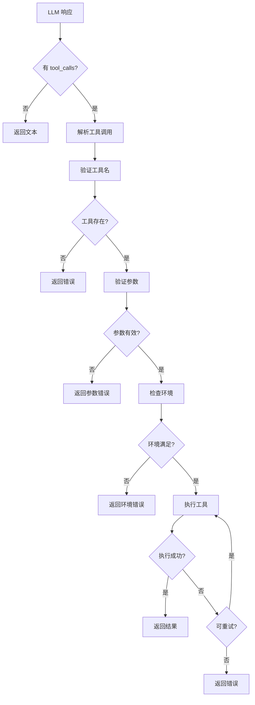
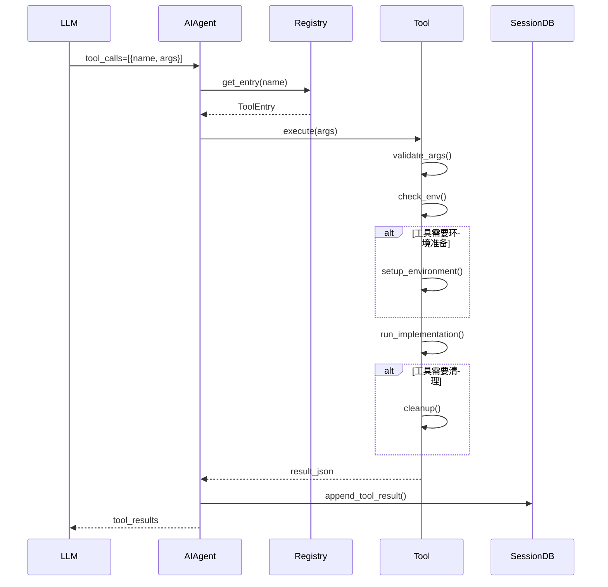
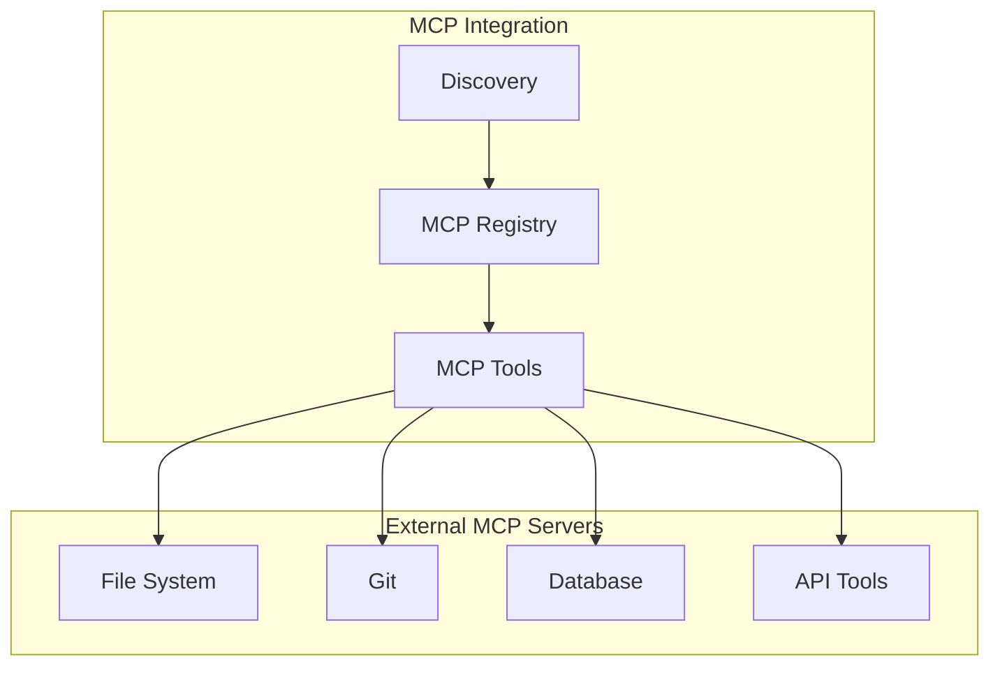
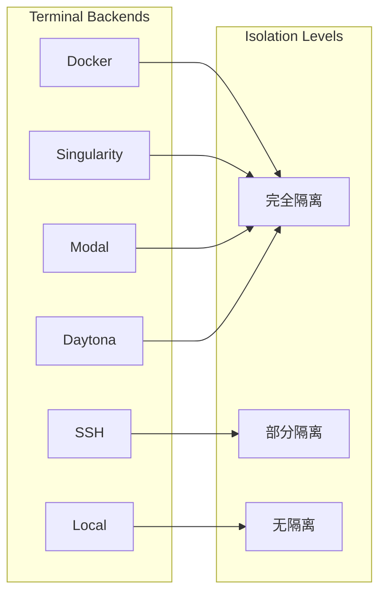

# 第十部分：Tool / MCP 分析

## 10.1 工具调用机制

### 10.1.1 调用流程



### 10.1.2 工具执行时序图



## 10.2 工具注册机制

### 10.2.1 注册流程

```python
# tools/registry.py
class ToolRegistry:
    def register(self, name, toolset, schema, handler, 
                 check_fn=None, requires_env=None, **kwargs):
        """注册工具"""
        entry = ToolEntry(
            name=name,
            toolset=toolset,
            schema=schema,
            handler=handler,
            check_fn=check_fn,
            requires_env=requires_env or [],
            **kwargs
        )
        self._tools[name] = entry
        self._generation += 1
```

### 10.2.2 自注册模式

```python
# tools/example_tool.py
from tools.registry import registry

def check_requirements() -> bool:
    return bool(os.getenv("API_KEY"))

def example_tool(param: str, task_id: str = None) -> str:
    return json.dumps({"success": True, "data": param})

registry.register(
    name="example_tool",
    toolset="example",
    schema={
        "name": "example_tool",
        "description": "An example tool",
        "parameters": {
            "type": "object",
            "properties": {
                "param": {"type": "string"}
            }
        }
    },
    handler=lambda args, **kw: example_tool(**kw),
    check_fn=check_requirements,
    requires_env=["API_KEY"],
)
```

## 10.3 工具发现机制

```python
# 自动发现流程
def discover_builtin_tools():
    tools_dir = Path(__file__).parent
    for path in tools_dir.glob("*.py"):
        if path.name in ("__init__.py", "registry.py", "mcp_tool.py"):
            continue
        if _module_registers_tools(path):
            importlib.import_module(f"tools.{path.stem}")
```

## 10.4 MCP 支持情况



```python
# tools/mcp_tool.py - MCP 工具集成
class MCPTool:
    """MCP 协议工具"""
    
    def __init__(self, server_config: dict):
        self.server = self._connect(server_config)
    
    def list_tools(self) -> List[ToolSchema]:
        """列出 MCP 服务器提供的工具"""
        return self.server.list_tools()
    
    def call_tool(self, name: str, args: dict) -> str:
        """调用 MCP 工具"""
        result = self.server.call_tool(name, args)
        return json.dumps(result)
```

## 10.5 工具分类

| 类别 | 工具 | 说明 |
|-----|------|-----|
| **Terminal** | `terminal` | 命令执行 |
| **Browser** | `browser_navigate`, `browser_click` | 浏览器控制 |
| **File** | `read_file`, `write_file`, `patch` | 文件操作 |
| **Search** | `web_search`, `search_files` | 搜索功能 |
| **Code** | `execute_code`, `write_approval` | 代码执行 |
| **Memory** | `memory`, `session_search` | 记忆管理 |
| **Delegation** | `delegate_task` | 子 Agent |
| **Skills** | `skill_manage`, `skill_use` | 技能管理 |
| **Communication** | `send_message` | 消息发送 |
| **MCP** | 动态加载 | MCP 协议工具 |

## 10.6 权限模型

```python
# tools/approval.py - 命令审批
class ApprovalSystem:
    """危险命令审批系统"""
    
    DANGEROUS_PATTERNS = [
        "rm -rf",
        "sudo",
        "drop table",
        "DELETE FROM",
        # ...
    ]
    
    def check_approval(self, command: str, session_key: str) -> str:
        """检查是否需要审批"""
        if self._is_safe(command):
            return "approved"
        elif self._is_denylisted(command):
            return "denied"
        elif self._is_allowed(session_key, command):
            return "approved"
        else:
            return "pending"  # 需要用户确认
```

## 10.7 沙箱模型



## 10.8 工具集定义

```python
# toolsets.py - 工具集定义
TOOLSETS = {
    "terminal": {
        "tools": ["terminal", "read_terminal_tool"],
        "description": "Terminal command execution",
    },
    "browser": {
        "tools": ["browser_navigate", "browser_click", "browser_type"],
        "description": "Browser automation",
    },
    "file": {
        "tools": ["read_file", "write_file", "patch", "search_files"],
        "description": "File operations",
    },
    "delegation": {
        "tools": ["delegate_task"],
        "description": "Subagent delegation",
    },
    "memory": {
        "tools": ["memory", "session_search"],
        "description": "Memory management",
    },
    "safe": {
        "tools": ["web_search", "read_file"],
        "description": "Read-only safe tools",
    },
}
```

## 10.9 工具输出限制

```python
# tools/tool_output_limits.py
class ToolOutputLimits:
    """工具输出大小限制"""
    
    DEFAULT_MAX_CHARS = 50_000
    DEFAULT_MAX_LINES = 5_000
    
    LIMITS = {
        "terminal": {"max_chars": 100_000, "max_lines": 10_000},
        "read_file": {"max_chars": 200_000, "max_lines": None},
        "browser": {"max_chars": 50_000, "max_lines": 2_000},
        "search_files": {"max_chars": 30_000, "max_lines": 500},
    }
    
    def truncate(self, output: str, tool_name: str) -> str:
        limits = self.LIMITS.get(tool_name, self.DEFAULT)
        if limits.max_chars and len(output) > limits.max_chars:
            output = output[:limits.max_chars] + "\n... [truncated]"
        return output
```
