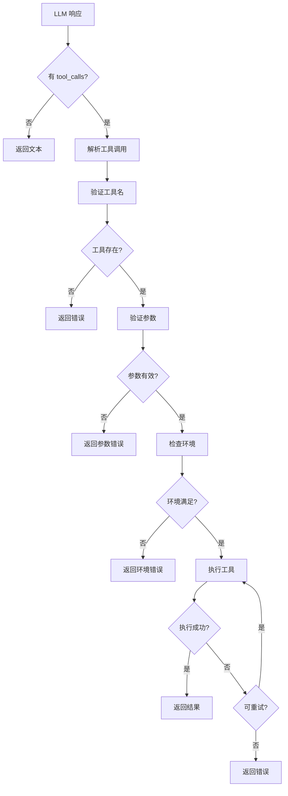
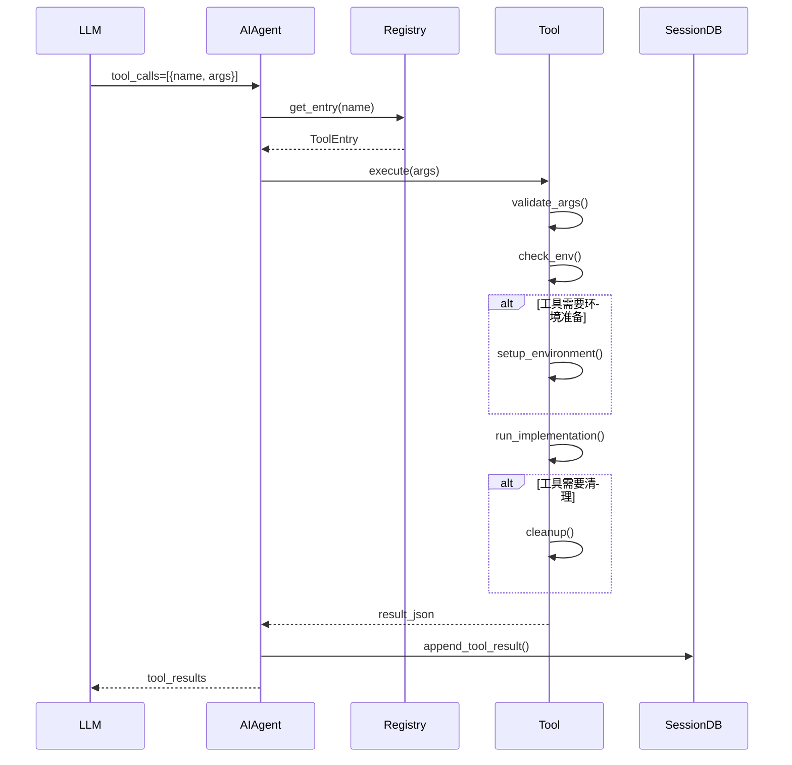
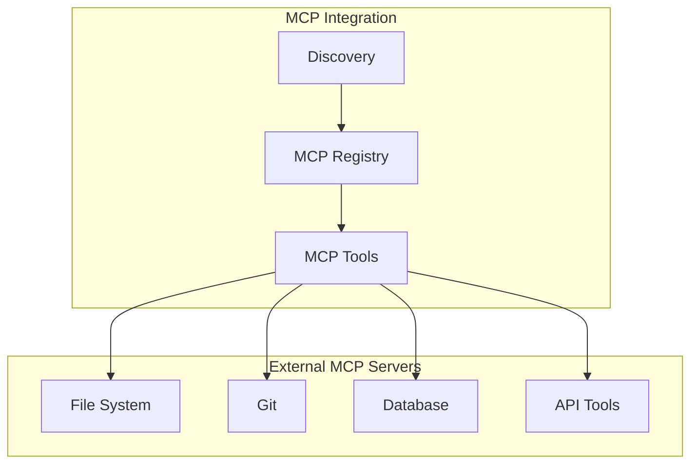
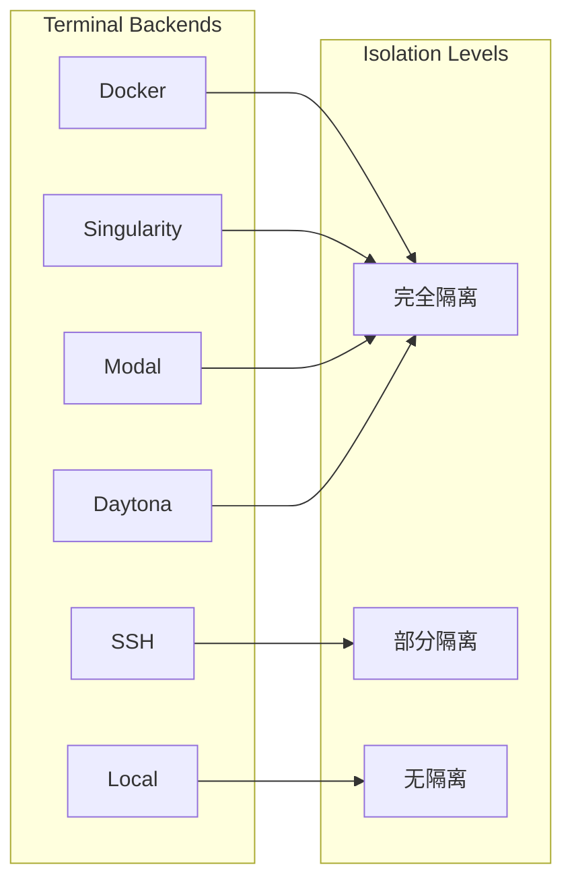

# 第十部分：Tool / MCP 分析

## 10.1 工具调用机制

### 10.1.1 调用流程



### 10.1.2 工具执行时序图



## 10.2 工具注册机制

### 10.2.1 注册流程

```python
# tools/registry.py
class ToolRegistry:
    # 真实签名 (registry.py:234)
    def register(
        self,
        name,
        toolset,
        schema,
        handler,
        check_fn=None,
        requires_env=None,
        is_async=False,
        description="",
        emoji="",
        max_result_size_chars=None,
        dynamic_schema_overrides=None,
        override=False,
    ):
        """注册工具，构建 ToolEntry 并写入工具表"""
        entry = ToolEntry(
            name=name,
            toolset=toolset,
            schema=schema,
            handler=handler,
            check_fn=check_fn,
            requires_env=requires_env or [],
            is_async=is_async,
            description=description,
            emoji=emoji,
            max_result_size_chars=max_result_size_chars,
        )
        self._tools[name] = entry
        self._generation += 1  # 自增代际，使工具快照失效


# ToolEntry 是一个使用 __slots__ 的类 (registry.py:77)
class ToolEntry:
    __slots__ = ("name", "toolset", "schema", "handler", "check_fn",
                 "requires_env", "is_async", "description", "emoji",
                 "max_result_size_chars", ...)
```

### 10.2.2 自注册模式

```python
# tools/example_tool.py
from tools.registry import registry

def check_requirements() -> bool:
    return bool(os.getenv("API_KEY"))

def example_tool(param: str, task_id: str = None) -> str:
    return json.dumps({"success": True, "data": param})

registry.register(
    name="example_tool",
    toolset="example",
    schema={
        "name": "example_tool",
        "description": "An example tool",
        "parameters": {
            "type": "object",
            "properties": {
                "param": {"type": "string"}
            }
        }
    },
    handler=lambda args, **kw: example_tool(**kw),
    check_fn=check_requirements,
    requires_env=["API_KEY"],
)
```

## 10.3 工具发现机制

```python
# 自动发现流程 —— discover_builtin_tools 是 registry.py:57 的模块级函数
# （不是 ToolRegistry 的方法，也不存在 get_all_tools 方法）
def discover_builtin_tools(tools_dir: Optional[Path] = None) -> List[str]:
    tools_dir = tools_dir or Path(__file__).parent
    for path in tools_dir.glob("*.py"):
        if path.name in ("__init__.py", "registry.py", "mcp_tool.py"):
            continue
        if _module_registers_tools(path):
            importlib.import_module(f"tools.{path.stem}")
```

## 10.4 MCP 支持情况



```python
# tools/mcp_tool.py - MCP 客户端集成
# 这里没有 MCPTool 类，也没有 list_tools()/call_tool() 方法。
# 真实内容是一组用于连接/校验外部 MCP 服务器的函数与一个采样处理类：
def _resolve_stdio_command(command: str, env: dict) -> tuple[str, dict]:
    """解析以 stdio 方式启动的 MCP 服务器命令"""
    ...

def _validate_remote_mcp_url(server_name: str, url: Any) -> str:
    """校验远程 MCP 服务器 URL"""
    ...

class SamplingHandler:  # (tools/mcp_tool.py:846)
    """处理 MCP 服务器发起的 sampling（让宿主代为调用 LLM）请求"""
    ...


# 而 MCP 服务器的"宿主"（把 Hermes 自身的能力作为 MCP server 暴露出去）
# 实现在根目录 mcp_serve.py：
#   - def create_mcp_server(event_bridge=None) -> "FastMCP"  (:450) 基于 FastMCP 构建
#   - class EventBridge  (:204) 在 MCP 与内部事件之间桥接
```

## 10.5 工具分类

| 类别 | 工具 | 说明 |
|-----|------|-----|
| **Terminal** | `terminal` | 命令执行 |
| **Browser** | `browser_navigate`, `browser_click` | 浏览器控制 |
| **File** | `read_file`, `write_file`, `patch` | 文件操作 |
| **Search** | `web_search`, `search_files` | 搜索功能 |
| **Code** | `execute_code`, `write_approval` | 代码执行 |
| **Memory** | `memory`, `session_search` | 记忆管理 |
| **Delegation** | `delegate_task` | 子 Agent |
| **Skills** | `skill_manage`, `skill_use` | 技能管理 |
| **Communication** | `send_message` | 消息发送 |
| **MCP** | 动态加载 | MCP 协议工具 |

## 10.6 权限模型

```python
# tools/approval.py - 命令审批
# 注意：这里没有 ApprovalSystem 类。审批能力由一组模块级函数 + contextvar 会话状态实现，
# 例如 detect_hardline_command()（:333，识别 hardline 危险命令）、
# _check_sudo_stdin_guard()（:314）、以及 set_current_session_key() 等用于
# 在调用上下文中传递会话/可观测性信息的辅助函数。下面用伪代码示意其语义：

# 危险命令检测（示意，真实实现见 detect_hardline_command 等函数）
def detect_hardline_command(command: str) -> tuple:
    """识别需要用户确认的高危命令（如 rm -rf / sudo 等），返回判定结果"""
    ...
```

## 10.7 沙箱模型



## 10.8 工具集定义

```python
# toolsets.py - 工具集定义 (TOOLSETS 起始于 :89)
# 每个条目的真实形状为 {"description":.., "tools":[..], "includes":[..]}
TOOLSETS = {
    "terminal": {
        "description": "Terminal/command execution and process management tools",
        "tools": ["terminal", "process"],   # 注意是 terminal + process（没有 read_terminal_tool）
        "includes": [],
    },
    "file": {
        "description": "File operations",
        "tools": ["read_file", "write_file", "patch", "search_files"],
        "includes": [],
    },
    "delegation": {
        "description": "Subagent delegation",
        "tools": ["delegate_task"],
        "includes": [],
    },
    "memory": {
        "description": "Memory management",
        "tools": ["memory"],                # memory 工具集只有 memory
        "includes": [],
    },
    "session_search": {                      # session_search 是独立工具集 (:220)，不并入 memory
        "description": "Search and recall past conversations with summarization",
        "tools": ["session_search"],
        "includes": [],
    },
    # ... 其余工具集（web/vision/skills/code_execution 等）
}
```

## 10.9 工具输出限制

```python
# 工具输出大小限制并没有集中在某个 ToolOutputLimits 类 / 全局 LIMITS 字典中
# （二者均不存在）。限制是**按工具在注册时**通过 register(..., max_result_size_chars=...)
# 单独声明的，由 ToolEntry 持有、循环在收集结果时据此截断。
#
# 例如 tools/file_tools.py:1757 起的注册：
registry.register(
    name="read_file", toolset="file", schema=READ_FILE_SCHEMA,
    handler=_handle_read_file, check_fn=_check_file_reqs, emoji="📖",
    max_result_size_chars=100_000,         # 该工具的输出上限
)
registry.register(
    name="write_file", toolset="file", schema=WRITE_FILE_SCHEMA,
    handler=_handle_write_file, check_fn=_check_file_reqs, emoji="✍️",
    max_result_size_chars=100_000,
)
# patch / search_files 同样各自声明 max_result_size_chars=100_000
```
