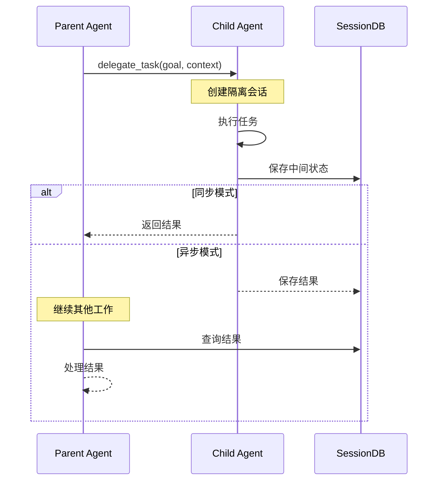
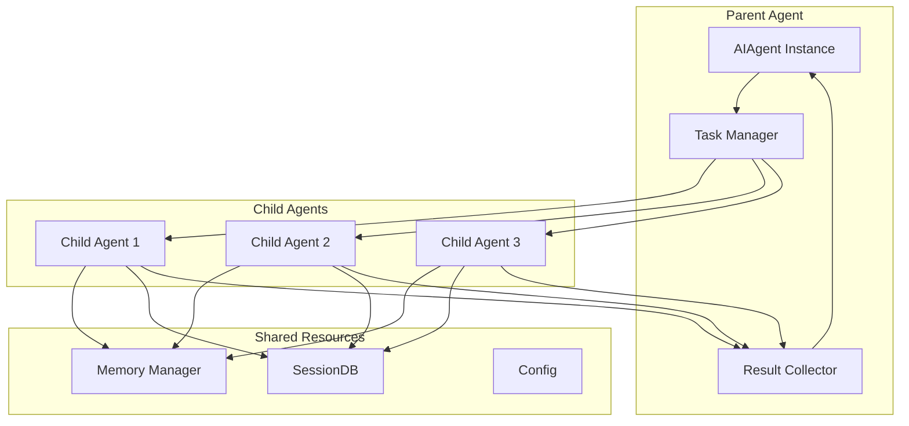
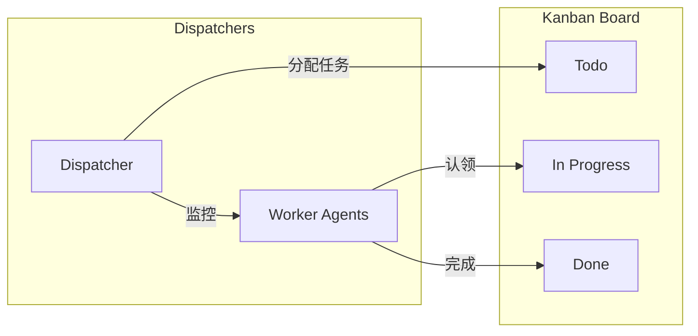

# 第十一部分：多 Agent 分析

## 11.1 多 Agent 支持概述

Hermes Agent 通过 `delegate_task` 工具支持多 Agent 协作：

```
┌─────────────────────────────────────────────────────────────────┐
│                    Multi-Agent 架构                               │
├─────────────────────────────────────────────────────────────────┤
│                                                                  │
│                        Parent Agent                               │
│                            │                                      │
│           ┌────────────────┼────────────────┐                   │
│           ▼                ▼                ▼                    │
│     ┌──────────┐     ┌──────────┐     ┌──────────┐              │
│     │  Child   │     │  Child   │     │  Child   │              │
│     │  Agent 1 │     │  Agent 2 │     │  Agent 3 │              │
│     │  (leaf)  │     │  (leaf)  │     │  (leaf)  │              │
│     └──────────┘     └──────────┘     └──────────┘              │
│                                                                  │
└─────────────────────────────────────────────────────────────────┘
```

## 11.2 支持的模式

### 11.2.1 Orchestrator-Leaf 模式

```python
# 父 Agent 作为 orchestrator，分派子任务给 leaf 子 Agent
result = delegate_task(
    goal="分析这三个代码文件并生成报告",
    tasks=[
        {"goal": "分析 file1.py", "context": "文件路径..."},
        {"goal": "分析 file2.py", "context": "文件路径..."},
        {"goal": "分析 file3.py", "context": "文件路径..."},
    ],
    role="orchestrator"  # 可分派；子任务默认为 leaf
)
```

### 11.2.2 Planner-Executor 模式

```python
# Planner 规划，Executor 执行
orchestrator = delegate_task(
    goal="完成这个项目",
    context="项目描述...",
    role="orchestrator"  # 可创建子计划
)
```

## 11.3 Agent 间通信协议



## 11.4 委托工具详解

```python
# tools/delegate_tool.py
# delegate_task 是模块级函数（delegate_tool.py:2074），并非 DelegateTool 类的方法。
def delegate_task(
    goal: str = None,
    context: str = None,
    toolsets: List[str] = None,
    tasks: List[Dict] = None,
    max_iterations: int = None,
    acp_command: str = None,
    acp_args: list = None,
    role: str = None,        # 仅 "leaf" | "orchestrator"，未知值经 _normalize_role 强制为 leaf
    background: bool = False,
    parent_agent=None,
) -> str:
    """委托任务给子 Agent"""

    # 1. 规范化角色（tools/delegate_tool.py:351 _normalize_role）
    role = _normalize_role(role)  # leaf 或 orchestrator
    if role == "leaf":
        blocked_tools = DELEGATE_BLOCKED_TOOLS
    else:  # orchestrator 允许再次 delegate_task
        blocked_tools = DELEGATE_BLOCKED_TOOLS - {"delegate_task"}

    # 2. 构建子 Agent（tools/delegate_tool.py:981 _build_child_agent）
    child = _build_child_agent(
        toolsets=toolsets,
        blocked_tools=blocked_tools,
        max_iterations=max_iterations,
        # ... 其他配置
    )

    # 3. 执行：后台异步 / 并行 fan-out / 单任务
    ...
```

## 11.5 多 Agent 架构图



## 11.6 并行执行控制

> 注：代码中并无 `ParallelExecution` 类。真实的 fan-out 由 `delegate_task` 内部使用一个守护 `ThreadPoolExecutor` 实现，并发上限读自 `_get_max_concurrent_children`（`tools/delegate_tool.py:368`），异步上限读自 `_get_max_async_children`（:412）。下列为说明性伪代码。

```python
# 说明性伪代码：并行 fan-out（真实实现内联在 delegate_task 中）
def _run_parallel(tasks: List[Dict]) -> List[str]:
    max_workers = _get_max_concurrent_children()  # config: max_concurrent_children，默认 3
    with ThreadPoolExecutor(max_workers=max_workers) as executor:
        futures = {
            executor.submit(_run_task, task): task
            for task in tasks
        }
        results = []
        for future in as_completed(futures):
            try:
                results.append(future.result())
            except Exception as e:
                results.append(f"Error: {e}")
        return results
```

## 11.7 结果汇总机制

> 注：`aggregate_results` 为说明性示例，非代码中的真实函数。实际子 Agent 输出由 `_extract_output_tail`（`tools/delegate_tool.py:232`）提取并回传给父 Agent。下列伪代码仅示意"成功/失败分类汇总"的思路。

```python
# 说明性伪代码：汇总多个子 Agent 的结果
def aggregate_results(results: List[str]) -> str:
    
    # 1. 分类结果
    successes = [r for r in results if not r.startswith("Error:")]
    failures = [r for r in results if r.startswith("Error:")]
    
    # 2. 生成汇总
    summary = f"""
    ## 任务汇总
    
    成功: {len(successes)}/{len(results)}
    失败: {len(failures)}
    
    ### 成功结果
    """
    
    for i, result in enumerate(successes, 1):
        summary += f"\n#### 任务 {i}\n{result}\n"
    
    if failures:
        summary += f"\n### 失败任务\n"
        for i, error in enumerate(failures, 1):
            summary += f"- 任务 {i}: {error}\n"
    
    return summary
```

## 11.8 角色与权限

| 角色 | 权限 | 描述 |
|-----|------|-----|
| `leaf` | 基础工具集 | 不能委托、不能调用 `DELEGATE_BLOCKED_TOOLS` 中的工具 |
| `orchestrator` | 可再委托 | 可继续调用 `delegate_task` 创建子 Agent |

> 注：代码中仅存在 `leaf` 与 `orchestrator` 两种角色（`_normalize_role`，`tools/delegate_tool.py:351` 会将未知值强制为 `leaf`）。不存在 `manager` / `worker` 角色。

```python
# 工具阻止列表
DELEGATE_BLOCKED_TOOLS = frozenset([
    "delegate_task",  # 阻止递归委托
    "clarify",        # 阻止用户交互
    "memory",         # 阻止写入共享记忆
    "send_message",   # 阻止跨平台副作用
    "execute_code",    # 阻止危险代码
])
```

## 11.9 深度控制

```python
# 最大深度限制
MAX_DEPTH = 1  # 默认: parent -> child (一层)

# 配置项
delegation:
  max_spawn_depth: 2  # 可配置深度
  max_concurrent_children: 3
  child_timeout_seconds: 300
```

## 11.10 Kanban 多 Agent 协作



```python
# hermes_cli/kanban.py - 看板 CLI
# 配合 tools/kanban_tools.py - 看板工具集

KANBAN_TOOLS = [
    "kanban_create",    # 创建任务
    "kanban_show",      # 显示看板
    "kanban_list",      # 列出任务
    "kanban_complete",  # 完成任务
    "kanban_block",     # 阻塞任务
    "kanban_unblock",   # 解除阻塞
    "kanban_comment",   # 评论
    "kanban_heartbeat", # 心跳/认领状态
]
```
