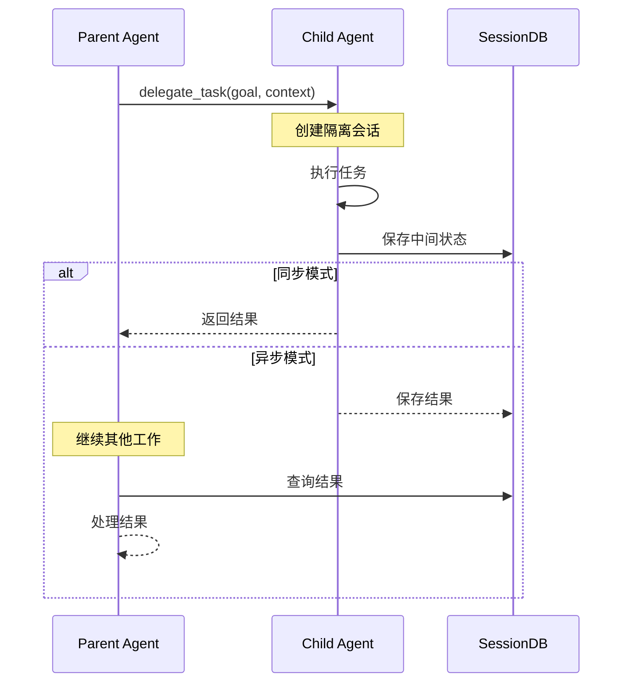
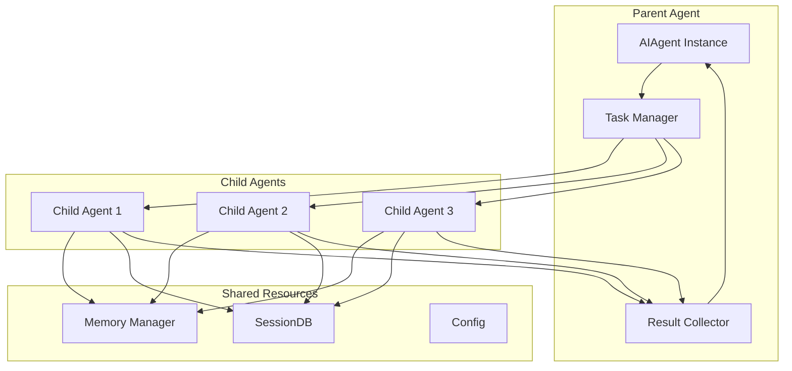
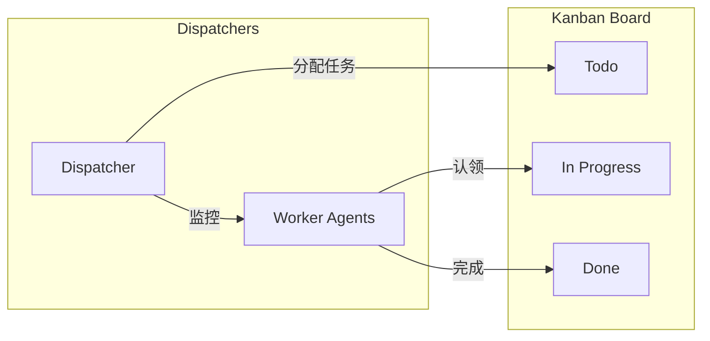

# 第十一部分：多 Agent 分析

## 11.1 多 Agent 支持概述

Hermes Agent 通过 `delegate_task` 工具支持多 Agent 协作：

```
┌─────────────────────────────────────────────────────────────────┐
│                    Multi-Agent 架构                               │
├─────────────────────────────────────────────────────────────────┤
│                                                                  │
│                        Parent Agent                               │
│                            │                                      │
│           ┌────────────────┼────────────────┐                   │
│           ▼                ▼                ▼                    │
│     ┌──────────┐     ┌──────────┐     ┌──────────┐              │
│     │  Child   │     │  Child   │     │  Child   │              │
│     │  Agent 1 │     │  Agent 2 │     │  Agent 3 │              │
│     │ (Worker) │     │ (Worker) │     │ (Worker) │              │
│     └──────────┘     └──────────┘     └──────────┘              │
│                                                                  │
└─────────────────────────────────────────────────────────────────┘
```

## 11.2 支持的模式

### 11.2.1 Manager-Worker 模式

```python
# 父 Agent 作为 Manager，分派任务给 Worker
result = delegate_task(
    goal="分析这三个代码文件并生成报告",
    tasks=[
        {"goal": "分析 file1.py", "context": "文件路径..."},
        {"goal": "分析 file2.py", "context": "文件路径..."},
        {"goal": "分析 file3.py", "context": "文件路径..."},
    ],
    role="manager"  # 可分派
)
```

### 11.2.2 Planner-Executor 模式

```python
# Planner 规划，Executor 执行
orchestrator = delegate_task(
    goal="完成这个项目",
    context="项目描述...",
    role="orchestrator"  # 可创建子计划
)
```

## 11.3 Agent 间通信协议



## 11.4 委托工具详解

```python
# tools/delegate_tool.py
class DelegateTool:
    """子 Agent 委托工具"""
    
    def delegate_task(
        self,
        goal: str,
        tasks: List[Dict] = None,
        context: str = None,
        role: str = "leaf",  # leaf | orchestrator
        background: bool = False,
        toolsets: List[str] = None,
        max_iterations: int = None,
        **kwargs
    ) -> str:
        """委托任务给子 Agent"""
        
        # 1. 验证角色
        if role == "leaf":
            blocked_tools = DELEGATE_BLOCKED_TOOLS
        else:  # orchestrator
            blocked_tools = DELEGATE_BLOCKED_TOOLS - {"delegate_task"}
        
        # 2. 创建子 Agent
        child = AIAgent(
            base_url=self.base_url,
            model=self.model,
            toolsets=toolsets,
            blocked_tools=blocked_tools,
            max_iterations=max_iterations or 30,
            # ... 其他配置
        )
        
        # 3. 执行
        if background:
            return self._start_background(child, goal, context)
        elif tasks:
            return self._run_parallel(children, tasks)
        else:
            return child.run_conversation(goal, context)
```

## 11.5 多 Agent 架构图



## 11.6 并行执行控制

```python
# 并行执行配置
class ParallelExecution:
    def __init__(self):
        self.max_concurrent = 3  # 最大并发数
        self.timeout = 300  # 超时秒数
    
    def run_parallel(self, tasks: List[Dict]) -> List[str]:
        """并行执行多个任务"""
        with ThreadPoolExecutor(max_workers=self.max_concurrent) as executor:
            futures = {
                executor.submit(self._run_task, task): task
                for task in tasks
            }
            results = []
            for future in as_completed(futures, timeout=self.timeout):
                try:
                    result = future.result()
                    results.append(result)
                except Exception as e:
                    results.append(f"Error: {e}")
            return results
```

## 11.7 结果汇总机制

```python
def aggregate_results(results: List[str]) -> str:
    """汇总多个子 Agent 的结果"""
    
    # 1. 分类结果
    successes = [r for r in results if not r.startswith("Error:")]
    failures = [r for r in results if r.startswith("Error:")]
    
    # 2. 生成汇总
    summary = f"""
    ## 任务汇总
    
    成功: {len(successes)}/{len(results)}
    失败: {len(failures)}
    
    ### 成功结果
    """
    
    for i, result in enumerate(successes, 1):
        summary += f"\n#### 任务 {i}\n{result}\n"
    
    if failures:
        summary += f"\n### 失败任务\n"
        for i, error in enumerate(failures, 1):
            summary += f"- 任务 {i}: {error}\n"
    
    return summary
```

## 11.8 角色与权限

| 角色 | 权限 | 描述 |
|-----|------|-----|
| `leaf` | 基础工具集 | 不能委托、不能调用某些危险工具 |
| `worker` | 扩展工具集 | 可以使用更多工具 |
| `orchestrator` | 全部工具 | 可以创建子 Agent |

```python
# 工具阻止列表
DELEGATE_BLOCKED_TOOLS = frozenset([
    "delegate_task",  # 阻止递归委托
    "clarify",        # 阻止用户交互
    "memory",         # 阻止写入共享记忆
    "send_message",   # 阻止跨平台副作用
    "execute_code",    # 阻止危险代码
])
```

## 11.9 深度控制

```python
# 最大深度限制
MAX_DEPTH = 1  # 默认: parent -> child (一层)

# 配置项
delegation:
  max_spawn_depth: 2  # 可配置深度
  max_concurrent_children: 3
  child_timeout_seconds: 300
```

## 11.10 Kanban 多 Agent 协作



```python
# hermes_cli/kanban.py - 看板 CLI
# 配合 tools/kanban_tools.py - 看板工具集

KANBAN_TOOLS = [
    "kanban_create",    # 创建任务
    "kanban_show",     # 显示看板
    "kanban_complete", # 完成任务
    "kanban_block",    # 阻塞任务
    "kanban_comment",  # 评论
    "kanban_link",     # 关联任务
]
```
