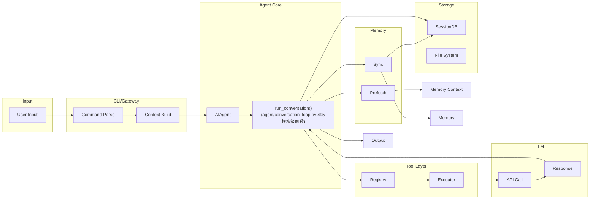
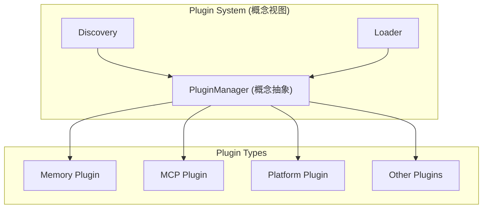

# 第十二部分：数据流分析

## 12.1 完整数据流



## 12.2 数据结构变化

### 12.2.1 消息结构演变

```python
# 用户输入 -> 消息对象
user_message = {
    "role": "user",
    "content": "帮我写一个排序算法"
}

# LLM 响应 -> 消息对象（带工具调用）
assistant_with_tools = {
    "role": "assistant",
    "content": "我来帮你写一个快速排序算法。",
    "tool_calls": [
        {
            "id": "call_123",
            "type": "function",
            "function": {
                "name": "write_file",
                "arguments": '{"path": "sort.py", "content": "..."}'
            }
        }
    ]
}

# 工具结果 -> 消息对象
tool_result = {
    "role": "tool",
    "tool_call_id": "call_123",
    "content": '{"success": true, "path": "sort.py"}'
}
```

### 12.2.2 上下文变化

```
初始上下文:
┌─────────────────────────────────────┐
│ [System: 你是一个有帮助的助手]        │
│ [User: 帮我写排序算法]                │
└─────────────────────────────────────┘

添加工具调用后:
┌─────────────────────────────────────┐
│ [System: 你是一个有帮助的助手]        │
│ [User: 帮我写排序算法]                │
│ [Assistant: 我来帮你写...]            │
│ [Tool: call_123 -> write_file]       │
│ [Tool Result: success]              │
└─────────────────────────────────────┘

压缩后:
┌─────────────────────────────────────┐
│ [System: ...]                       │
│ [System: 压缩摘要: 用户请求排序...]    │
│ [Assistant: 我来帮你写...]           │
│ [Tool: call_123 -> write_file]      │
│ [Tool Result: success]              │
└─────────────────────────────────────┘
```

## 12.3 Prompt 变化

```python
# 初始 System Prompt
SYSTEM_PROMPT = """
你是一个有帮助的 AI 助手。
当前时间: {current_time}
用户工作目录: {cwd}
"""

# 添加技能后
SYSTEM_PROMPT += """
## 可用技能
{skills_block}
"""

# 添加记忆后
SYSTEM_PROMPT += """
## 记忆上下文
{memory_block}
"""

# 最终消息列表
messages = [
    {"role": "system", "content": final_system_prompt},
    {"role": "user", "content": user_input},
    # ... 历史消息 ...
]
```

---

# 第十三部分：扩展机制分析

## 13.1 扩展点矩阵

| 扩展点 | 方法 | 说明 |
|-------|------|-----|
| **新增 Agent** | 继承 AIAgent | 创建新的 Agent 子类 |
| **新增 Tool** | registry.register() | 工具自注册 |
| **新增 Skill** | 创建 SKILL.md | 技能定义 |
| **新增 Memory** | 实现 MemoryProvider | 记忆提供者插件 |
| **新增 Model** | 实现 Provider Adapter | 模型适配器 |
| **新增 UI** | 独立前端 | 独立界面 |
| **新增 MCP** | MCP 服务器 | MCP 协议扩展 |

## 13.2 新增 Tool

```python
# Step 1: 创建工具文件
# tools/my_tool.py

from tools.registry import registry
import json

def my_tool(param: str, task_id: str = None) -> str:
    """我的自定义工具"""
    return json.dumps({"result": f"Processed: {param}"})

registry.register(
    name="my_tool",
    toolset="custom",
    schema={
        "name": "my_tool",
        "description": "我的自定义工具",
        "parameters": {
            "type": "object",
            "properties": {
                "param": {"type": "string"}
            }
        }
    },
    handler=lambda args, **kw: my_tool(**kw),
)

# Step 2: 添加到工具集
# toolsets.py
TOOLSETS["custom"] = {
    "tools": ["my_tool", ...],
}
```

## 13.3 新增 Memory Provider

```python
# plugins/memory/my_memory/__init__.py

from agent.memory_provider import MemoryProvider

class MyMemoryProvider(MemoryProvider):
    @property
    def name(self) -> str:
        return "mymemory"
    
    def is_available(self) -> bool:
        return True
    
    def initialize(self, session_id: str, **kwargs):
        # 初始化连接
        pass
    
    def prefetch(self, query: str, session_id: str = "") -> str:
        # 检索相关记忆
        return self.search(query)
    
    def sync_turn(self, user: str, assistant: str, **kwargs):
        # 存储对话
        self.store(user, assistant)
    
    def get_tool_schemas(self) -> List[Dict]:
        return []
```

## 13.4 新增 Model Provider

```python
# plugins/model-providers/myprovider/__init__.py

from providers import register_provider

register_provider(ProviderProfile(
    name="myprovider",
    models=["model-a", "model-b"],
    base_url="https://api.myprovider.com/v1",
    supports_functions=True,
    supports_vision=True,
    requires_api_key=True,
))
```

## 13.5 新增 Skill

```markdown
# skills/my-skill/SKILL.md

---
name: my-skill
description: 执行某个特定任务。
version: 1.0.0
platforms: [linux, macos, windows]
---

# My Skill

执行特定任务的能力。

## Prerequisites

- Python 3.x

## How to Run

1. 准备输入
2. 执行脚本
3. 处理输出
```

## 13.6 插件系统

> 注：下面的 `PluginManager` 为概念抽象，非代码中的真实类。`plugins/` 目录由 `__init__.py` 与各功能子目录（`browser/`、`memory/`、`cron/`、`platforms/` 等）组成；`plugins/plugin_utils.py` 仅提供 `lazy_singleton` 与 `SingletonSlot` 等工具，并无 `PluginManager`。下列伪代码仅示意"发现 + 注册"思路。



```python
# 说明性伪代码（非真实类）：插件发现与注册思路
class PluginManager:  # 概念抽象，非代码中的真实类
    def discover_plugins(self):
        """发现插件"""
        # 从 ~/.hermes/plugins/ 发现
        # 从 ./plugins/ 发现
        # 从 pip 发现
        pass
    
    def register(self, plugin):
        """注册插件"""
        for hook in plugin.hooks:
            self.hooks[hook].append(plugin)
```
