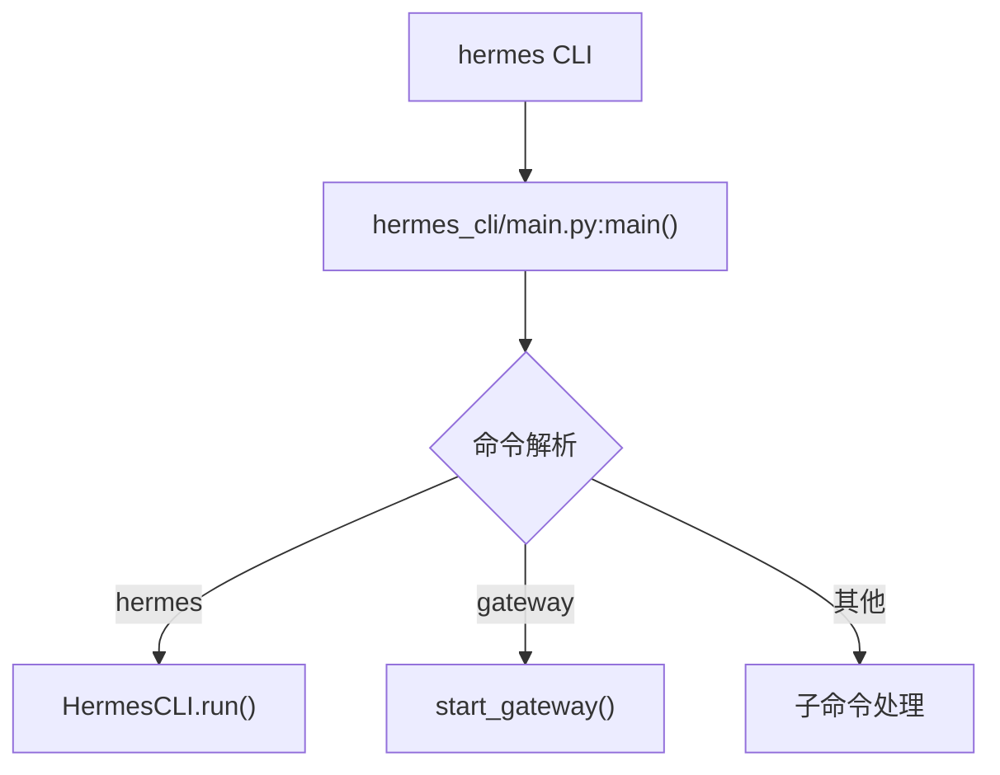
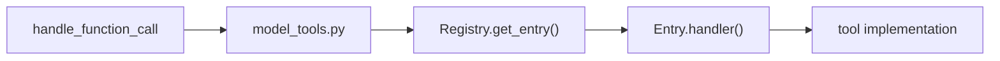
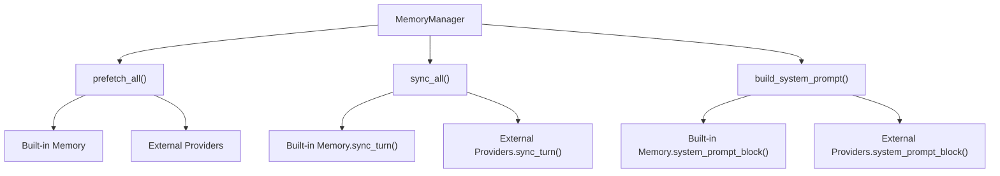
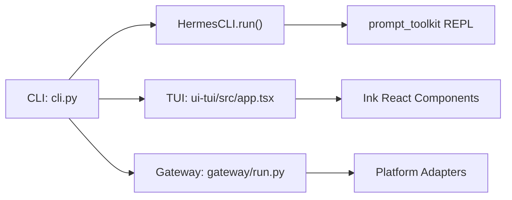

# 第十四部分：技术选型分析

## 14.1 技术栈概览

| 类别 | 选择 | 原因 |
|-----|------|-----|
| **主语言** | Python 3.11+ | 生态丰富、易于集成 LLM |
| **TUI 语言** | TypeScript + React | 现代化 UI 开发 |
| **数据存储** | SQLite + FTS5 | 轻量、可靠、支持全文搜索 |
| **HTTP 客户端** | httpx | 同步/异步支持 |
| **LLM SDK** | 多种适配器 | 支持多 Provider |
| **CLI UI** | prompt_toolkit + Rich | 精美终端 UI |

## 14.2 为什么选择 Python

### 优点

```
1. LLM 生态丰富 - OpenAI、Anthropic、HuggingFace 等官方 SDK
2. 快速原型 - 动态类型、快速迭代
3. 丰富的工具库 - 数据处理、网络请求、系统集成
4. 广泛的社区支持 - AI/ML 领域的事实标准
5. 易于集成 - C扩展、FFI、subprocess
```

### 缺点

```
1. 性能 - 相比 Go/Rust 较慢
2. GIL 限制 - 多线程并行受限
3. 类型系统 - 运行时错误
4. 部署复杂度 - 依赖管理
```

## 14.3 为什么选择 TypeScript (TUI)

```
1. React 生态 - 组件化开发
2. 类型安全 - 编译时检查
3. 跨平台 - Electron、Web
4. 现代化工具链 - Vite、ESBuild
5. 与后端解耦 - JSON-RPC 通信
```

## 14.4 为什么选择 SQLite

### 优点

```
1. 零配置 - 无需独立服务
2. 轻量 - 单文件存储
3. 可靠 - ACID 事务
4. WAL 模式 - 支持并发读
5. FTS5 - 内置全文搜索
6. 跨平台 - Windows/Linux/macOS
7. 嵌入式 - 无网络开销
```

### 缺点

```
1. 并发写限制 - 单写多读
2. 规模限制 - TB 级数据
3. 无集群 - 不支持分布式
4. 管理工具 - 相比 PG 较弱
```

## 14.5 为什么选择 httpx

```
1. 同步/异步统一 - 既支持 CLI 同步调用，也支持网关异步调用
2. 现代化设计 - 基于 HTTP/2
3. 自动重试 - 内置重试机制
4. 超时控制 - 精细化配置
5. 代理支持 - 完整的代理功能
```

## 14.6 为什么选择 prompt_toolkit + Rich

```
1. prompt_toolkit - 交互式输入、自动补全
2. Rich - 精美的格式化输出
3. 互补性强 - 一个管输入，一个管输出
4. 纯 Python - 无原生依赖
```

---

# 第十五部分：源码关键路径分析

## 15.1 程序入口



### 15.1.1 CLI 入口

```python
# hermes_cli/main.py
def main():
    parser = create_parser()
    args = parser.parse_args()
    
    if args.command == "run":
        cli = HermesCLI()
        cli.run()
    elif args.command == "gateway":
        from gateway.run import start_gateway
        start_gateway()
```

### 15.1.2 Gateway 入口

```python
# gateway/run.py
async def start_gateway():
    runner = GatewayRunner()
    await runner.start()
```

## 15.2 Agent 入口

```python
# run_agent.py
class AIAgent:
    def __init__(self, ...):
        # 初始化组件
        self._memory_manager = MemoryManager()
        self._iteration_budget = IterationBudget(max_iterations)
    
    def chat(self, message: str) -> str:
        """简单接口"""
        result = self.run_conversation(message)
        return result.get("final_response", "")
    
    def run_conversation(self, user_message: str, ...) -> dict:
        """完整接口"""
        # 调用 conversation_loop
        return conversation_loop.run_turn(self, user_message)
```

## 15.3 Loop 入口

```python
# agent/conversation_loop.py
def run_turn(agent: AIAgent, user_message: str) -> str:
    # 1. 前置准备
    messages = build_turn_context(agent, user_message)
    
    # 2. LLM 调用循环
    while True:
        response = call_llm(agent, messages)
        
        if response.tool_calls:
            # 执行工具
            for call in response.tool_calls:
                result = handle_function_call(call.name, call.args)
                messages.append(tool_result_message(result))
        else:
            # 返回结果
            return response.content
```

## 15.4 Tool 入口



```python
# model_tools.py
def handle_function_call(function_name: str, function_args: dict, 
                         task_id: str = None, **kwargs) -> str:
    # 1. 获取工具条目
    entry = registry.get_entry(function_name)
    
    # 2. 验证参数
    validate_args(entry.schema, function_args)
    
    # 3. 执行
    result = entry.handler(function_args, task_id=task_id, **kwargs)
    
    # 4. 后处理
    return post_process_result(result)
```

## 15.5 Memory 入口



## 15.6 UI 入口



## 15.7 调用链总结

```
┌─────────────────────────────────────────────────────────────────┐
│                      完整调用链                                    │
├─────────────────────────────────────────────────────────────────┤
│                                                                  │
│  User Input                                                      │
│      │                                                           │
│      ▼                                                           │
│  CLI/TUI/Gateway                                                 │
│      │                                                           │
│      ▼                                                           │
│  HermesCLI.run() / start_gateway()                               │
│      │                                                           │
│      ▼                                                           │
│  AIAgent.run_conversation()                                      │
│      │                                                           │
│      ├──► MemoryManager.prefetch_all()                          │
│      │                                                           │
│      ▼                                                           │
│  ConversationLoop.run_turn()                                     │
│      │                                                           │
│      ├──► build_turn_context()                                   │
│      │                                                           │
│      ▼                                                           │
│  LLM API Call (Provider Adapter)                                 │
│      │                                                           │
│      ▼                                                           │
│  handle_function_call() ──────────────────────────┐              │
│      │                                          │              │
│      ├──► ToolRegistry.get_entry()              │              │
│      │                                          │              │
│      └──► entry.handler()                       │              │
│              │                                  │              │
│              ▼                                  │              │
│          Tool Result                            │              │
│              │                                  │              │
│              └──────────────────────────────────┘              │
│                                                                  │
│  Final Response                                                  │
│      │                                                           │
│      ├──► MemoryManager.sync_all()                              │
│      │                                                           │
│      └──► SessionDB.save_messages()                             │
│                                                                  │
└─────────────────────────────────────────────────────────────────┘
```
