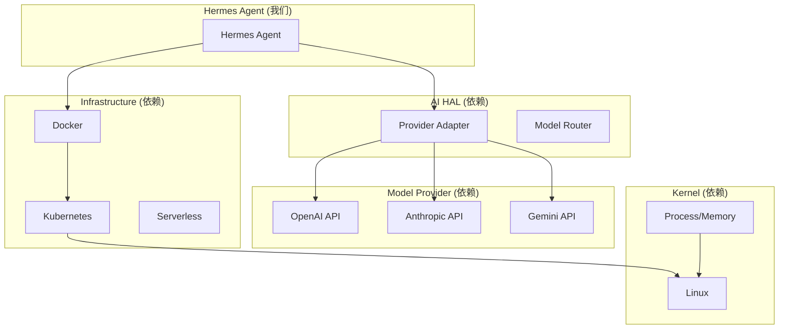

# 第二十一部分：Agentic OS 映射分析

## 21.1 Agentic OS 层次结构

```
┌─────────────────────────────────────────────────────────────────────────┐
│                    Agentic OS 完整层次架构                                  │
├─────────────────────────────────────────────────────────────────────────┤
│                                                                          │
│   ┌─────────────────────────────────────────────────────────────────┐   │
│   │                    Application Layer (应用层)                      │   │
│   │    Skill / Tool / Agent App / Workflow / Plugin                 │   │
│   └─────────────────────────────────────────────────────────────────┘   │
│                                    ↓ ↑                                   │
│   ┌─────────────────────────────────────────────────────────────────┐   │
│   │                    Agent / Harness Layer (Agent 层)                  │   │
│   │    AIAgent / ConversationLoop / Planner / Executor                 │   │
│   └─────────────────────────────────────────────────────────────────┘   │
│                                    ↓ ↑                                   │
│   ┌─────────────────────────────────────────────────────────────────┐   │
│   │                    Runtime Layer (运行时层)                        │   │
│   │    Memory Manager / Context Manager / Compression                  │   │
│   └─────────────────────────────────────────────────────────────────┘   │
│                                    ↓ ↑                                   │
│   ┌─────────────────────────────────────────────────────────────────┐   │
│   │                 Workflow Engine Layer (工作流引擎层)                 │   │
│   │    Cron / Kanban / Delegate / Checkpoint                          │   │
│   └─────────────────────────────────────────────────────────────────┘   │
│                                    ↓ ↑                                   │
│   ┌─────────────────────────────────────────────────────────────────┐   │
│   │                  Memory OS Layer (记忆操作系统层)                    │   │
│   │    SessionDB / FTS5 / MemoryProvider / Cache                      │   │
│   └─────────────────────────────────────────────────────────────────┘   │
│                                    ↓ ↑                                   │
│   ┌─────────────────────────────────────────────────────────────────┐   │
│   │                   Tool/MCP Bus Layer (工具总线层)                    │   │
│   │    Tool Registry / MCP Client / Plugin Bus                         │   │
│   └─────────────────────────────────────────────────────────────────┘   │
│                                    ↓ ↑                                   │
│   ┌─────────────────────────────────────────────────────────────────┐   │
│   │                    AI HAL Layer (AI 硬件抽象层)                      │   │
│   │    Provider Adapter / Model Router / Token Manager                  │   │
│   └─────────────────────────────────────────────────────────────────┘   │
│                                    ↓ ↑                                   │
│   ┌─────────────────────────────────────────────────────────────────┐   │
│   │                 Model Provider Layer (模型提供者层)                    │   │
│   │    OpenAI / Anthropic / Gemini / Local Model                      │   │
│   └─────────────────────────────────────────────────────────────────┘   │
│                                    ↓ ↑                                   │
│   ┌─────────────────────────────────────────────────────────────────┐   │
│   │                Container / K8S Layer (容器编排层)                    │   │
│   │    Docker / Kubernetes / Serverless / Daytona / Modal              │   │
│   └─────────────────────────────────────────────────────────────────┘   │
│                                    ↓ ↑                                   │
│   ┌─────────────────────────────────────────────────────────────────┐   │
│   │                      Linux / Kernel Layer                         │   │
│   │    Process / Memory / FileSystem / Network / Security             │   │
│   └─────────────────────────────────────────────────────────────────┘   │
│                                                                          │
└─────────────────────────────────────────────────────────────────────────┘
```

## 21.2 Hermes Agent 所在层次

```
┌─────────────────────────────────────────────────────────────────────────┐
│                         Hermes Agent 层次定位                              │
├─────────────────────────────────────────────────────────────────────────┤
│                                                                          │
│   ┌─────────────────────────────────────────────────────────────────┐   │
│   │  Android Framework  ═══════════════════════════════════════     │   │
│   │                         Application Layer                        │   │
│   │  ════════════════════════════════════════════════════════════    │   │
│   │  Hermes Skills / Plugins / Workflow Apps                         │   │
│   └─────────────────────────────────────────────────────────────────┘   │
│                                    ↓ ↑                                   │
│   ┌─────────────────────────────────────────────────────────────────┐   │
│   │  System Server ══════════════════════════════════════════════    │   │
│   │                    Agent / Harness Layer                          │   │
│   │  ════════════════════════════════════════════════════════════    │   │
│   │  ★★★ AIAgent / ConversationLoop / Tool Executor ★★★           │   │
│   │  ★★★ MemoryManager / Session Management ★★★                    │   │
│   └─────────────────────────────────────────────────────────────────┘   │
│                                    ↓ ↑                                   │
│   ┌─────────────────────────────────────────────────────────────────┐   │
│   │  ART (Android Runtime) ════════════════════════════════════    │   │
│   │                      Runtime Layer                               │   │
│   │  ════════════════════════════════════════════════════════════    │   │
│   │  Context Compressor / Iteration Budget / Checkpoint Manager     │   │
│   └─────────────────────────────────────────────────────────────────┘   │
│                                    ↓ ↑                                   │
│   ┌─────────────────────────────────────────────────────────────────┐   │
│   │  Dalvik/ART ═════════════════════════════════════════════════    │   │
│   │                 Workflow Engine Layer                             │   │
│   │  ════════════════════════════════════════════════════════════    │   │
│   │  Cron Scheduler / Kanban Board / Delegate Task                  │   │
│   └─────────────────────────────────────────────────────────────────┘   │
│                                    ↓ ↑                                   │
│   ┌─────────────────────────────────────────────────────────────────┐   │
│   │  Binder IPC ════════════════════════════════════════════════    │   │
│   │                   Memory OS Layer                                │   │
│   │  ════════════════════════════════════════════════════════════    │   │
│   │  SessionDB + FTS5 / MemoryProvider Plugin / Cache               │   │
│   └─────────────────────────────────────────────────────────────────┘   │
│                                    ↓ ↑                                   │
│   ┌─────────────────────────────────────────────────────────────────┐   │
│   │  HAL Interface ═════════════════════════════════════════════    │   │
│   │                   Tool/MCP Bus Layer                             │   │
│   │  ════════════════════════════════════════════════════════════    │   │
│   │  Tool Registry / MCP Client / Plugin Discovery                   │   │
│   └─────────────────────────────────────────────────────────────────┘   │
│                                    ↓ ↑                                   │
│   ┌─────────────────────────────────────────────────────────────────┐   │
│   │  Kernel Drivers ════════════════════════════════════════════     │   │
│   │                    AI HAL Layer                                  │   │
│   │  ════════════════════════════════════════════════════════════    │   │
│   │  Provider Adapter / Model Router / Token Manager                 │   │
│   └─────────────────────────────────────────────────────────────────┘   │
│                                    ↓ ↑                                   │
│   ┌─────────────────────────────────────────────────────────────────┐   │
│   │  Linux Kernel ═══════════════════════════════════════════════    │   │
│   │                 Model Provider Layer                             │   │
│   │  ════════════════════════════════════════════════════════════    │   │
│   │  OpenAI API / Anthropic API / Local LLM                         │   │
│   └─────────────────────────────────────────────────────────────────┘   │
│                                    ↓ ↑                                   │
│   ┌─────────────────────────────────────────────────────────────────┐   │
│   │  Hardware ════════════════════════════════════════════════════    │   │
│   │               Container / K8S Layer                              │   │
│   │  ════════════════════════════════════════════════════════════    │   │
│   │  Docker / K8S / Serverless / Daytona / Modal                    │   │
│   └─────────────────────────────────────────────────────────────────┘   │
│                                    ↓ ↑                                   │
│   ┌─────────────────────────────────────────────────────────────────┐   │
│   │  Hardware ════════════════════════════════════════════════════    │   │
│   │                  Linux / Kernel Layer                            │   │
│   │  ════════════════════════════════════════════════════════════    │   │
│   │  CPU / Memory / Disk / Network                                   │   │
│   └─────────────────────────────────────────────────────────────────┘   │
│                                                                          │
└─────────────────────────────────────────────────────────────────────────┘
```

## 21.3 层次对比分析

| 传统 OS 概念 | Agentic OS 对应 | Hermes 实现 | 说明 |
|-------------|----------------|-------------|------|
| **Application** | Skill / Workflow App | `skills/`, `plugins/` | 用户级任务封装 |
| **System Service** | Agent Runtime | `run_agent.py`, `conversation_loop.py` | 核心运行时 |
| **Android Runtime** | Context Manager | `turn_context.py`, `context_compressor.py` | 字节码/上下文管理 |
| **Framework** | Workflow Engine | `cron/`, `kanban/`, `delegate_tool.py` | 高级抽象 |
| **Binder IPC** | Memory Bus | `SessionDB`, `memory_manager.py` | 跨进程通信 |
| **HAL** | Tool/MCP Bus | `registry.py`, `mcp_tool.py` | 硬件抽象 |
| **Kernel Driver** | AI Adapter | `*_adapter.py` | 设备驱动 |
| **System Call** | Model API | OpenAI/Anthropic API | 系统调用 |
| **Hardware** | Compute | GPU/Cloud | 物理资源 |

## 21.4 Hermes 向上提供的能力

### 21.4.1 应用开发能力

```
┌─────────────────────────────────────────────────────────────────┐
│                   Hermes 提供的应用层能力                            │
├─────────────────────────────────────────────────────────────────┤
│                                                                  │
│  1. Agent 运行时                                                  │
│     - 对话循环引擎                                                │
│     - 工具调用编排                                                │
│     - 状态管理                                                    │
│                                                                  │
│  2. 技能系统                                                     │
│     - SKILL.md 规范                                               │
│     - 技能发现和加载                                              │
│     - 技能执行环境                                                │
│                                                                  │
│  3. 工作流抽象                                                   │
│     - Cron 定时任务                                               │
│     - Kanban 看板                                                 │
│     - 委托任务                                                    │
│                                                                  │
│  4. 插件系统                                                     │
│     - Memory Provider                                            │
│     - Model Provider                                             │
│     - Platform Adapter                                           │
│                                                                  │
└─────────────────────────────────────────────────────────────────┘
```

### 21.4.2 API 接口

```python
# Hermes 提供给上层应用的接口

# 1. AIAgent 接口
class AIAgent:
    def chat(self, message: str) -> str
    def run_conversation(self, user_message: str, ...) -> dict

# 2. Skill 接口
class Skill:
    def load() -> str           # 加载技能
    def execute(context) -> Any  # 执行技能

# 3. Memory 接口
class MemoryProvider:
    def prefetch(query) -> str
    def sync_turn(user, assistant)

# 4. Tool 接口
def register_tool(name, schema, handler)
```

## 21.5 Hermes 向下依赖的能力

### 21.5.1 依赖层次图



### 21.5.2 依赖清单

| 依赖项 | 层级 | 说明 |
|-------|------|------|
| **httpx** | 网络库 | HTTP 客户端 |
| **OpenAI SDK** | AI HAL | OpenAI API 封装 |
| **Anthropic SDK** | AI HAL | Anthropic API 封装 |
| **SQLite** | Memory OS | 会话存储 |
| **prompt_toolkit** | UI | 命令行 UI |
| **Rich** | UI | 富文本输出 |
| **Docker SDK** | Container | Docker 集成 |
| **asyncssh** | Infra | SSH 连接 |
| **playwright** | Tool | 浏览器自动化 |

## 21.6 缺失的 Agent OS 接口

### 21.6.1 缺失接口矩阵

```
┌─────────────────────────────────────────────────────────────────────────┐
│                      Agent OS 接口缺失分析                                   │
├─────────────────────────────────────────────────────────────────────────┤
│                                                                          │
│   接口类别              现状              缺失程度        优先级              │
│   ─────────────────────────────────────────────────────────────────────  │
│                                                                          │
│   【进程管理】                                                          │
│   ├─ 进程创建           delegate_task       部分实现        高               │
│   ├─ 进程调度           ThreadPool          无              高               │
│   ├─ 进程通信           tool calls          基础实现        中               │
│   ├─ 进程同步           asyncio.Lock        基础实现        中               │
│   └─ 进程终止           interrupt           部分实现        高               │
│                                                                          │
│   【内存管理】                                                          │
│   ├─ 虚拟内存           无                  完全缺失        高               │
│   ├─ 内存分配           Python GC           依赖 Python     低               │
│   ├─ 内存隔离           子进程隔离          部分实现        高               │
│   ├─ 缓存管理           LRU Cache           基础实现        中               │
│   └─ 内存映射           SessionDB           部分实现        中               │
│                                                                          │
│   【文件系统】                                                          │
│   ├─ 文件操作           file_tools          完整实现        -                │
│   ├─ 目录管理           file_tools          完整实现        -                │
│   ├─ 权限控制           path_security       基础实现        高               │
│   ├─ 文件系统抽象       SessionDB           部分实现        中               │
│   └─ 虚拟文件系统       无                  完全缺失        中               │
│                                                                          │
│   【网络通信】                                                          │
│   ├─ HTTP 客户端       httpx               完整实现        -                │
│   ├─ WebSocket         gateway             完整实现        -                │
│   ├─ RPC               tool calls          基础实现        中               │
│   ├─ 服务发现           无                  完全缺失        低               │
│   └─ 负载均衡           无                  完全缺失        低               │
│                                                                          │
│   【安全管理】                                                          │
│   ├─ 用户认证           hermes_cli/auth     完整实现        -                │
│   ├─ 权限控制           approval.py         部分实现        高               │
│   ├─ 沙箱隔离           environments/       部分实现        高               │
│   ├─ 安全策略           security_advisories 基础实现        中               │
│   └─ 审计日志           hermes_logging      完整实现        -                │
│                                                                          │
│   【设备管理】                                                          │
│   ├─ 终端设备           terminal_tool      完整实现        -                │
│   ├─ 显示设备           CLI/TUI            完整实现        -                │
│   ├─ 存储设备           SessionDB          完整实现        -                │
│   ├─ 网络设备           HTTP Client        完整实现        -                │
│   └─ 传感器设备         无                  完全缺失        低               │
│                                                                          │
└─────────────────────────────────────────────────────────────────────────┘
```

### 21.6.2 关键缺失详解

#### 缺失 1: 进程调度

```python
# 当前实现：简单的线程池
with ThreadPoolExecutor(max_workers=self.max_concurrent) as executor:
    futures = {executor.submit(task): task for task in tasks}

# 缺失的 Agent OS 接口：
# - 优先级调度
# - 公平调度
# - 实时调度
# - 多级反馈队列
```

#### 缺失 2: 虚拟内存

```python
# 当前实现：Python GC + SessionDB
# 每个 Agent 实例共享进程内存

# 缺失的 Agent OS 接口：
# - Agent 级别的内存隔离
# - 内存 swap 到磁盘
# - 内存压力感知
# - COW (Copy-on-Write) 优化
```

#### 缺失 3: 服务发现

```python
# 当前实现：静态配置
providers:
  openai:
    api_key: xxx
  anthropic:
    api_key: xxx

# 缺失的 Agent OS 接口：
# - 动态服务注册
# - DNS/服务发现
# - 负载均衡
# - 健康检查
```

#### 缺失 4: 安全沙箱

```python
# 当前实现：基础的 environments 后端
environments:
  local:    # 无隔离
  docker:   # 容器隔离
  ssh:      # 远程隔离

# 缺失的 Agent OS 接口：
# - WebAssembly 沙箱
# - seccomp/AppArmor
# - 系统调用过滤
# - 资源配额强制
```

## 21.7 Hermes 在完整 Agentic OS 中的角色

### 21.7.1 角色定位

```
┌─────────────────────────────────────────────────────────────────────────┐
│                    Hermes Agent 在 Agentic OS 中的角色                       │
├─────────────────────────────────────────────────────────────────────────┤
│                                                                          │
│                        ╔═══════════════════════════╗                      │
│                        ║    Android Framework      ║                      │
│                        ║   ═══════════════════    ║                      │
│                        ║   Hermes Skills/Apps     ║                      │
│                        ╚═══════════════════════════╝                      │
│                                    ↓ ↑                                   │
│                        ╔═══════════════════════════╗                      │
│                        ║      System Server        ║                      │
│                        ║   ═══════════════════    ║                      │
│                        ║   ★ Hermes Agent Runtime ★ ║                     │
│                        ║   AIAgent + Tool Executor  ║                    │
│                        ╚═══════════════════════════╝                      │
│                                    ↓ ↑                                   │
│                        ╔═══════════════════════════╗                      │
│                        ║         ART             ║                      │
│                        ║   ═══════════════════    ║                      │
│                        ║   Context Manager        ║                      │
│                        ║   Memory Manager         ║                      │
│                        ╚═══════════════════════════╝                      │
│                                    ↓ ↑                                   │
│                        ╔═══════════════════════════╗                      │
│                        ║        HAL               ║                      │
│                        ║   ═══════════════════    ║                      │
│                        ║   Provider Adapters      ║                      │
│                        ║   Tool Registry          ║                      │
│                        ╚═══════════════════════════╝                      │
│                                    ↓ ↑                                   │
│                        ╔═══════════════════════════╗                      │
│                        ║        Linux             ║                      │
│                        ║   ═══════════════════    ║                      │
│                        ║   Docker / K8S           ║                      │
│                        ║   Network / Storage       ║                      │
│                        ╚═══════════════════════════╝                      │
│                                                                          │
│   Hermes = Android Framework + System Server + ART 的 Agent化合体           │
│                                                                          │
└─────────────────────────────────────────────────────────────────────────┘
```

### 21.7.2 与 Android 架构对比

| Android 组件 | Hermes 对应 | 差异 |
|-------------|-----------|------|
| **Application** | Skills/Plugins | Skills 更轻量 |
| **Framework** | Agent Runtime | 功能更内聚 |
| **System Service** | Gateway/Cron | 更分散 |
| **ART** | Context Manager | 无 JIT/AOT |
| **HAL** | Provider Adapter | 更灵活 |
| **Kernel** | Linux/Docker | 相同 |

### 21.7.3 理想中的完整 Agentic OS

```
┌─────────────────────────────────────────────────────────────────────────┐
│                       理想中的完整 Agentic OS                              │
├─────────────────────────────────────────────────────────────────────────┤
│                                                                          │
│   Layer 7: Applications                                                │
│   ├─ Hermes Skills                                                     │
│   ├─ Third-party Skills                                                │
│   └─ Agent Apps                                                        │
│                                                                          │
│   Layer 6: Agent Framework                                             │
│   ├─ Workflow Engine (已有: Cron/Kanban)                               │
│   ├─ Intent System                                                     │
│   ├─ Skill Registry (已有)                                             │
│   └─ App Installer                                                     │
│                                                                          │
│   Layer 5: System Services                                             │
│   ├─ Hermes Agent Runtime (已有)                                       │
│   ├─ Notification Manager                                              │
│   ├─ Package Manager                                                   │
│   ├─ Account Manager                                                    │
│   └─ Window Manager (TUI)                                              │
│                                                                          │
│   Layer 4: Agent Runtime (ART)                                         │
│   ├─ Context Manager (已有)                                             │
│   ├─ Memory Manager (已有)                                              │
│   ├─ Security Manager                                                   │
│   ├─ Resource Manager                                                   │
│   └─ JIT/AOT Compiler                                                   │
│                                                                          │
│   Layer 3: Tool/MCP Bus                                                │
│   ├─ Tool Registry (已有)                                               │
│   ├─ MCP Client (已有)                                                  │
│   ├─ Plugin Bus (已有)                                                  │
│   └─ Device Manager                                                     │
│                                                                          │
│   Layer 2: AI HAL                                                      │
│   ├─ Provider Adapters (已有)                                           │
│   ├─ Model Router                                                      │
│   ├─ Token Manager (已有)                                               │
│   └─ Embedding Engine                                                   │
│                                                                          │
│   Layer 1: Linux Kernel + Container                                     │
│   └─ Docker/K8S (已有)                                                  │
│                                                                          │
└─────────────────────────────────────────────────────────────────────────┘
```

## 21.8 演进建议

### 21.8.1 短期演进（补全缺失接口）

```
┌─────────────────────────────────────────────────────────────────┐
│                 短期演进：补全 Agent OS 基础接口                      │
├─────────────────────────────────────────────────────────────────┤
│                                                                  │
│  Phase 1: 进程隔离增强                                           │
│  ├─ 引入 WebAssembly 沙箱                                         │
│  ├─ 进程级内存隔离                                               │
│  └─ 资源配额控制                                                 │
│                                                                  │
│  Phase 2: 虚拟内存                                              │
│  ├─ Agent 级别内存预算                                           │
│  ├─ LRU 内存淘汰                                                │
│  └─ Swap 到 SessionDB                                           │
│                                                                  │
│  Phase 3: 服务发现                                              │
│  ├─ 动态 Provider 注册                                          │
│  ├─ 健康检查机制                                                │
│  └─ 简单负载均衡                                                │
│                                                                  │
└─────────────────────────────────────────────────────────────────┘
```

### 21.8.2 中期演进（架构优化）

```
┌─────────────────────────────────────────────────────────────────┐
│                 中期演进：架构模块化                                      │
├─────────────────────────────────────────────────────────────────┤
│                                                                  │
│  Module 1: 拆分 Agent Core                                        │
│  ├─ 独立的 agent-runtime 包                                      │
│  ├─ 清晰的接口定义                                               │
│  └─ 可选的组件替换                                               │
│                                                                  │
│  Module 2: 标准化 Tool Bus                                        │
│  ├─ 统一的 Tool 接口                                             │
│  ├─ MCP 优先支持                                                │
│  └─ 热插拔支持                                                  │
│                                                                  │
│  Module 3: 强化 Memory OS                                        │
│  ├─ 可插拔存储后端                                               │
│  ├─ Redis 缓存层                                                │
│  └─ 分布式支持                                                  │
│                                                                  │
└─────────────────────────────────────────────────────────────────┘
```

### 21.8.3 长期演进（完整 Agentic OS）

```
┌─────────────────────────────────────────────────────────────────┐
│                 长期演进：完整的 Agentic OS                              │
├─────────────────────────────────────────────────────────────────┤
│                                                                  │
│  Goal: 类似 Android 的完整 Agent 操作系统                            │
│                                                                  │
│  Components:                                                     │
│  ├─ Agent Kernel: 核心进程调度、内存管理、安全                      │
│  ├─ Agent HAL: 标准化硬件抽象                                      │
│  ├─ Agent Framework: 应用开发框架                                  │
│  ├─ Agent SDK: 开发者工具包                                       │
│  └─ Agent Store: 技能和应用市场                                   │
│                                                                  │
│  Ecosystem:                                                     │
│  ├─ 开发者社区                                                   │
│  ├─ 技能市场                                                     │
│  ├─ 企业解决方案                                                 │
│  └─ 教育培训                                                     │
│                                                                  │
└─────────────────────────────────────────────────────────────────┘
```

## 21.9 结论

### Hermes 在 Agentic OS 中的定位

```
┌─────────────────────────────────────────────────────────────────┐
│                      最终定位结论                                     │
├─────────────────────────────────────────────────────────────────┤
│                                                                  │
│  Hermes Agent = "Agentic Android"                                 │
│                                                                  │
│  ├── Android Framework (应用开发框架)    ← Hermes Skills/Plugins  │
│  ├── System Server (系统服务)            ← Hermes Runtime          │
│  ├── ART (应用运行时)                    ← Context/Memory Manager │
│  ├── HAL (硬件抽象)                      ← Provider Adapter       │
│  └── Linux Kernel (内核)                ← Docker/K8S              │
│                                                                  │
│  扮演角色：System Server + ART 的混合体                            │
│                                                                  │
│  向上提供：Agent 运行时、技能系统、工作流引擎                       │
│  向下依赖：AI Provider (类比 GPU)、Container (类比硬件)           │
│                                                                  │
│  缺失接口：进程调度、虚拟内存、服务发现、强安全沙箱                  │
│                                                                  │
└─────────────────────────────────────────────────────────────────┘
```
