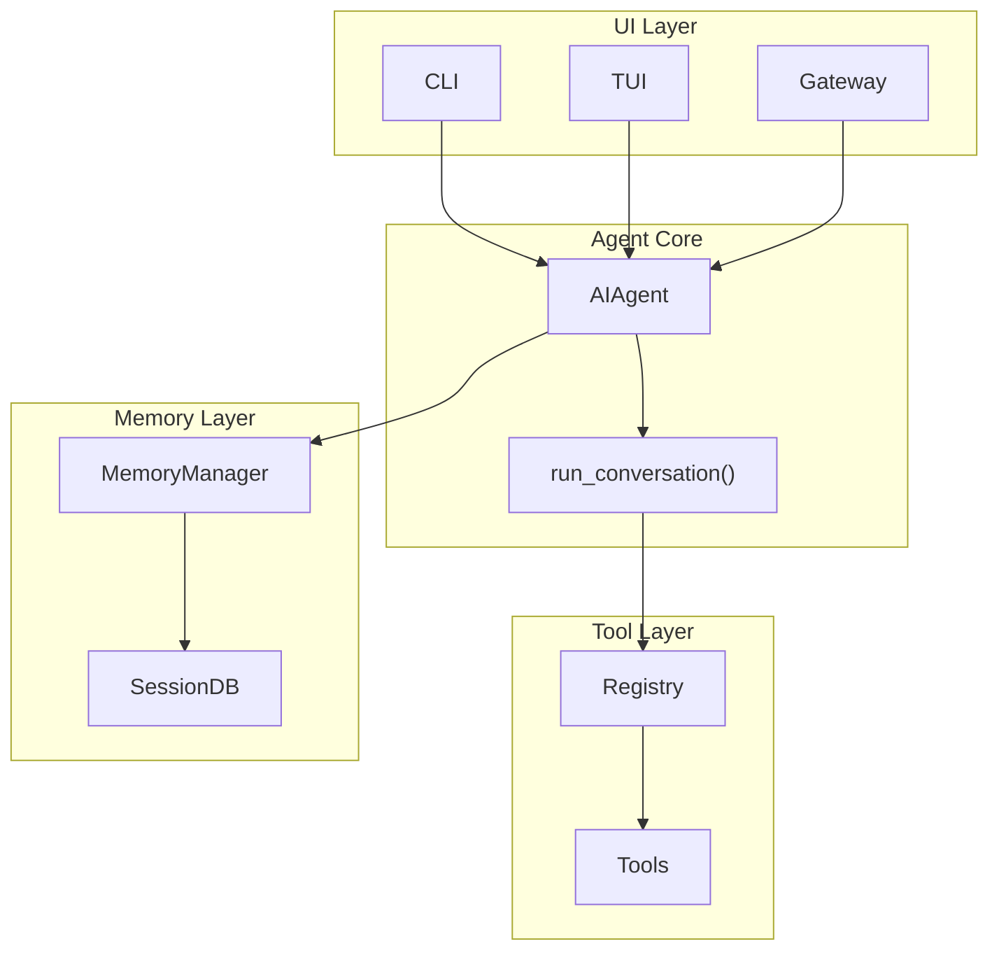

# Hermes Agent 架构级分析报告

> 本文档对 Hermes Agent 进行"源码级 + 架构级 + 产品级 + 生态级"的全面深度分析。

## 文档目录

| 文件 | 内容 |
|-----|------|
| [00-项目定位分析.md](./00-项目定位分析.md) | 项目定位、用户画像、核心竞争力、技术护城河 |
| [01-整体架构分析.md](./01-整体架构分析.md) | 完整架构图、各层职责、数据流向、控制流向 |
| [02-代码目录逆向分析.md](./02-代码目录逆向分析.md) | 目录树、核心类/接口/数据结构、设计模式 |
| [03-核心对象模型分析.md](./03-核心对象模型分析.md) | ER图、类图、对象关系图、生命周期 |
| [04-Agent运行机制分析.md](./04-Agent运行机制分析.md) | ReAct/Plan-Execute/Reflection、状态机、序列图 |
| [05-Runtime与Harness分析.md](./05-Runtime与Harness分析.md) | Runtime架构、资源管理、Harness状态机 |
| [06-Loop工程分析.md](./06-Loop工程分析.md) | Loop流程、失败重试、反思机制、检查点 |
| [07-Memory系统分析.md](./07-Memory系统分析.md) | 三层记忆架构、FTS5、压缩、淘汰策略 |
| [08-Tool与MCP分析.md](./08-Tool与MCP分析.md) | 工具调用/注册/发现、MCP支持、权限模型 |
| [09-多Agent分析.md](./09-多Agent分析.md) | Manager-Worker、Planner-Executor、并行执行 |
| [10-数据流与扩展机制分析.md](./10-数据流与扩展机制分析.md) | 完整数据流、扩展点矩阵 |
| [11-技术选型与关键路径分析.md](./11-技术选型与关键路径分析.md) | 技术栈选择理由、入口点分析 |
| [12-复刻指南.md](./12-复刻指南.md) | 六阶段复刻路线图、开发顺序 |
| [13-竞品对比与优缺点分析.md](./13-竞品对比与优缺点分析.md) | 与竞品对比、优缺点TOP20、技术债务 |
| [14-最终结论.md](./14-最终结论.md) | 创新点、复刻难点、最终评分 |
| [15-Agentic-OS映射分析.md](./15-Agentic-OS映射分析.md) | Agentic OS 层次映射、角色定位、缺失接口 |

## 快速导航

### 核心架构图



### 评分总览

| 维度 | 评分 |
|-----|------|
| 架构评分 | 85/100 |
| 工程评分 | 88/100 |
| Agent 能力评分 | 92/100 |
| 生态评分 | 78/100 |
| 未来潜力评分 | 90/100 |
| **综合评分** | **86.6/100** |

## 关键结论

### 最值得学习的部分
1. **工具注册机制** - 自注册模式的最佳实践
2. **Memory Provider 抽象** - 插件化设计的优秀范例
3. **会话管理** - FTS5 + SQLite 的高效使用
4. **上下文压缩** - 智能上下文管理

### 最难复刻的部分
1. **多平台消息适配** - 每个平台独特的处理逻辑
2. **提示缓存机制** - 需要深入理解模型行为
3. **Curator 技能策展** - LLM 评估循环
4. **终端后端抽象** - 不同环境的隔离

### 核心技术特点
- ✅ ReAct 循环 + 工具调用
- ✅ 多平台统一网关
- ✅ 自改进记忆系统
- ✅ 提示缓存优化
- ✅ 插件化架构
- ❌ 完全异步化
- ❌ 微服务架构

## 复刻路线图

```
Phase 1 (1-2周): CLI + Agent 基本对话
Phase 2 (2-3周): 工具调用循环
Phase 3 (3-4周): 完整工具系统
Phase 4 (2-3周): 记忆系统
Phase 5 (2-3周): 多 Agent 支持
Phase 6 (4-6周): 生产级能力

总计: 14-22 周
```
